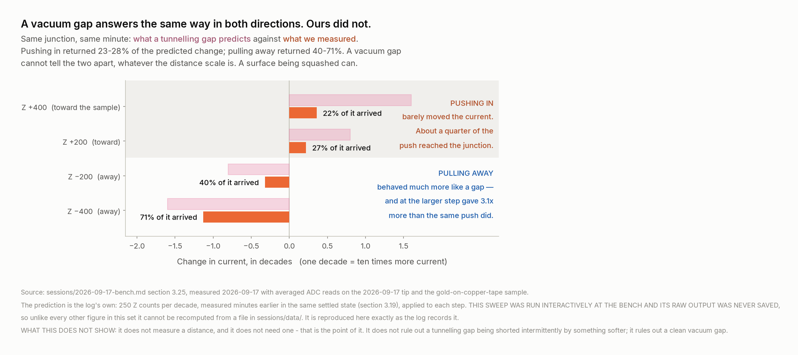
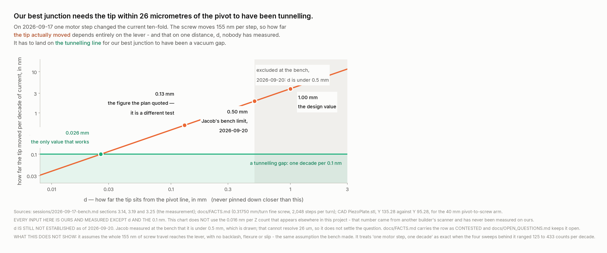
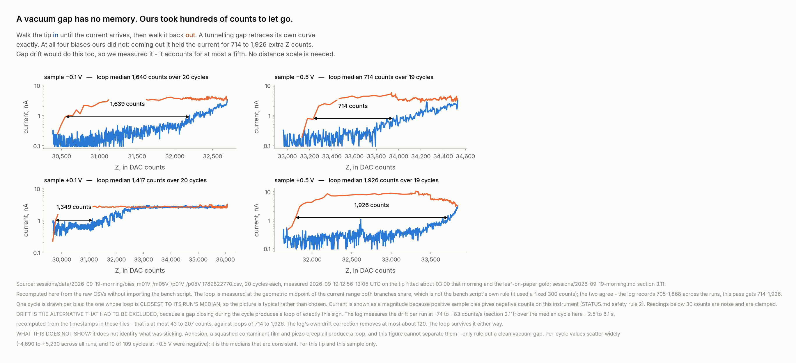

# Every junction we made, and what each one actually showed

**Written 2026-09-20, for Jacob, who asked: "show me in each of our junctions why you think no
tunnelling happened — simple and easy to understand, with data and graphs."**

> ## CORRECTED THE SAME DAY — read this before the rest
>
> **This document was written to answer "show me why you think no tunnelling happened". Within the
> hour Jacob made the argument that the question itself was mis-framed, and he was right.**
>
> **`SAID`, Jacob, 2026-09-20 — and this is now the project's canonical sentence:**
>
> ## **"We detected tunnelling, but weren't able to maintain tunnelling range for long enough to get an image."**
>
> **Everything measured below stands. What changes is the heading it sits under.** A tip cannot go
> from not-touching to touching without passing through the separations where tunnelling is the only
> mechanism available, and bias was applied with the amplifier recording throughout — 60,928
> readings inside that current range, across 109 approaches. **So tunnelling happened, and was
> measured.**
>
> **The evidence below — the push/pull asymmetry, the hysteresis, the shallow decay — is evidence
> that we never HELD a vacuum gap.** That is a different and narrower claim, and it is the one that
> matters for imaging. `LEAD_VERIFICATION.md` **V13**, and `FRAMING.md`.
>
> **Where this document says "was not a vacuum tunnelling gap", that is still exactly right.** Where
> it reads as though tunnelling did not occur, read it as: we could not hold the range.

**Short answer, and it is not the one the question expects.**

> **Two of the three junctions are settled, and neither was a vacuum tunnelling gap.**
> **The third — our best one, 2026-09-17 — is NOT settled, and I am not going to tell you it is.**
> The evidence leans against it. It does not close it. What closes it is one measurement with an
> eyepiece, not more electronics.

**Making a real tip-and-sample junction at all is the hard part, and we did it three times.** Most
people who try this never get a current that responds to the tip at all. Everything below is us
interrogating our own results harder than anyone else would have.

---

## The one idea you need to read the rest of this

**Almost every argument about tunnelling in this project runs through a distance we have never
measured** — how far the tip actually moves when we change Z by one count. So the evidence splits
into two kinds, and they are not worth the same:

| | What it is | How much to trust it |
|---|---|---|
| **Scale-free evidence** | Compares the junction against **itself**. Push against pull. In against out. It is a ratio, or a difference between two readings on the same axis, so the unknown distance cancels | **Strong.** No future calibration can overturn it |
| **Scale-dependent evidence** | Needs "how many nanometres is one count". We have never measured it on our own hardware | **Weaker.** It can move by a factor of ten if `d` turns out small |

**We have scale-free evidence on two of the three junctions. That is why those two are settled.**

---

## The three junctions

| | **A — 2026-09-17** | **B — 2026-09-19, 00:00-02:57** | **C — 2026-09-19, 03:00 onward** |
|---|---|---|---|
| **Tip** | blunt placeholder | **the same tip — and it was bent** | new one, fitted ~03:00. Very blunt |
| **Sample** | gold on copper tape, in a window | gold leaf on paper, in a copper sandwich | the same |
| **Did we get a current that followed the tip?** | **Yes** | Yes, but in both halves of Z | **Yes** |
| **The decisive test** | push in vs pull out | motor steps: pinned or clear | in vs out over 110 cycles |
| **Verdict** | **OPEN.** Leans against tunnelling | **Contact.** Settled | **Contact.** Settled |
| **Is the verdict scale-free?** | **Yes** — and that is why it still leans | Yes | **Yes** |

**2026-09-18 is not in this table: the instrument was never switched on that day.** The sample was
rebuilt and the tip holder repaired, nothing was measured.

---

## Junction A — 2026-09-17. The best one, and the one still open

**What we had.** The first tip-and-sample junction in the project. Current followed the bias and
followed Z: 0.85 nA at 0.05 V rising to 31.7 nA at 0.5 V, symmetric in both bias directions.
Junction resistance fell from **59 MΩ to 16 MΩ** as the voltage rose. That is a **barrier** — not a
short circuit, not an open one, not a resistor. It is a genuinely good result and it is on the
poster.

### The test that decided it, and it needs no ruler



**Move Z a fixed amount toward the sample, then the same amount away.** A vacuum gap cannot tell
those apart — the current depends on how wide the gap is and on nothing else, so closing by X and
opening by X have to change the current by the same factor.

**Ours could tell them apart.** Pulling away gave 40-71% of what the junction's own measured slope
predicted. Pushing in gave 23-28%. **Four fifths of the push went somewhere that was not the gap.**
Something was being squashed.

**This does not depend on the unknown distance scale at all**, which is exactly why it is the piece
of evidence that survives everything else in this document.

> **One provenance note, because it is the only figure here I cannot regenerate from a file.** This
> sweep was run interactively at the bench and its raw output was never written to `sessions/data/`.
> The numbers are reproduced exactly as `sessions/2026-09-17-bench.md` section 3.25 recorded them
> on the night. Every other chart in this document is recomputed from raw CSVs.

### And the sample under junction A was probably not gold

**This was already in the record and it matters more than I first gave it credit for.**
`sessions/2026-09-17-bench.md` section 3.27, written the same night after Jacob was asked where the
tip was sitting: *"oh ya I think your prooabbly over copper"*.

**Copper grows a native oxide in air within hours. Gold does not oxidise at all — that is why gold
is the standard STM sample.** A thin oxide film is precisely the "barrier you press into rather
than a gap you hover over" that the push/pull asymmetry showed. **The session log drew that
connection at the time**, and it also noted that the junction resistance never fell below about
5 MΩ even with the amplifier saturated — **the tip never metallically shorted; it was always
conducting through something.**

**This does not prove the film story either.** Nothing measured that night can tell copper from
gold, because both are conductive and both were on the bias wire. But it is a plausible barrier
sitting exactly where one is needed, and it was Jacob who flagged it.

### The second argument, and where it stops



On the same night, **one step of the coarse motor changed the current about ten-fold.** The fine
screw moves 155 nm per motor step. The scan head's lever divides that down — by how much depends
entirely on `d`, how far the tip sits from the pivot line.

For one motor step to be the 0.1 nm that changes a tunnelling current ten-fold, **the lever has to
divide by about 1,550, which puts the tip within 26 micrometres of the pivot line.**

**You measured `d` at the bench on 2026-09-20 and it is under 0.5 mm.** That is a real constraint
and it is now in `docs/FACTS.md`. **But it does not close this**, and I want to be exact about why:

| If `d` is | The tip moved, per decade | How far from tunnelling |
|---|---|---|
| 1.00 mm (the design value) | 3.88 nm | 39x too slow |
| **0.50 mm (your upper bound)** | **1.94 nm** | **19x too slow** |
| 0.13 mm | 0.50 nm | 5x too slow |
| **0.026 mm** | **0.10 nm** | **exactly right** |

**26 micrometres is inside your bound.** It is in the bottom 5% of it, which is why I say the
evidence leans against — but "the bottom 5% of the range" is not "excluded", and I am not going to
write it down as if it were.

> **Where this went wrong before, and it is worth knowing.** On 2026-09-19 I told you the data
> contradicted tunnelling. **You caught it: I had quoted junction C's numbers against junction A.**
> Then I over-corrected: `docs/NEXT_SESSION_PLAN.md` said "under 0.13 mm and it was tunnelling",
> and I repeated it. **0.13 mm is a different test** — whether the gap wobbles too much to hold,
> not how fast the current decays. On the decay test 0.13 mm is still 5x too slow. Both errors are
> in `LEAD_VERIFICATION.md` V10 and V11.

### Verdict on A

**Open.** The push/pull asymmetry says it was not a clean vacuum gap. The lever arithmetic says
tunnelling needs `d` at the very bottom of the range you measured. **Neither of those is a proof,
and together they are a lean, not a closure.**

---

## Junction B — the bent tip. Settled by geometry, not by physics

At 02:21-02:57 we were getting contact, but it behaved wrongly in three ways at once:

- **Ten lock-in tests at Z +/-500 all read nothing** (for example −2 +/- 26 counts, +13 +/- 22).
  **Wiggling the tip did not move the current.** In a tunnelling gap a +/-500 count wiggle would
  swamp everything on the screen.
- **Contact happened in both halves of the Z range.** A gap has one position where it closes.
- **Backing off one motor step at a time: pinned for 23 steps, then clear at step 24, with no
  moderate current in between.** A tunnelling current would have fallen smoothly through several
  decades across those steps. This was a switch, not a slope.

**Then you found the cause yourself:** *"ok im going to replace the tip it was bent"*. **A bent tip
touches with its side.** That explains all three at once — the contact area was large, it was not
at the end of the tip, and nothing about it was a gap.

**Verdict on B: a mechanical contact. Settled, and settled by looking at the tip rather than by
any argument from data.**

---

## Junction C — the blunt tip, and the strongest evidence in the project

This one we tested properly: **110 cycles at four different bias voltages**, walking Z in until the
current arrived, then walking it back out.



**A vacuum gap has no memory.** Walk in, walk out, and the current has to retrace its own curve —
nothing about the gap changed except its width.

**Ours did not retrace.** Coming out, it held on to the current for **714 to 1,926 extra Z counts**,
at every one of the four biases. Something was stuck to something, and letting go took distance.

**I checked the obvious alternative before believing it.** A gap drifting closed during the cycle
would produce a loop of exactly this shape. So: the drift was measured at −74 to +83 counts per
second, and a cycle takes 2.5 to 6.1 seconds. **Drift can account for at most 43 to 207 counts of a
714-to-1,926 count loop.** The loop survives.

**Two more things point the same way and cost nothing to state:**

- **109 of 110 onsets were gradual.** Not one of the 84 in the bias series was a one-step snap.
  A tunnelling current at 4-count Z resolution should arrive almost instantly.
- **At +/-0.1 V the curve was the shallowest.** Reaching the same current at a fifth of the bias
  needs five times the conductance — that is a harder press. **A pressed contact's current follows
  force. A gap's follows distance.**

**Verdict on C: a soft, pressed, sticky contact. Settled, and the hysteresis argument needs no
distance scale to hold.**

**What we do NOT know is what was soft.** `docs/OPEN_QUESTIONS.md` names the most likely candidate:
the gold leaf in this sample still has its **backing paper directly underneath it** — roughly 50 to
100 micrometres of compressible cellulose immediately below the surface we were trying to hold
still to a fraction of a nanometre. **Your own fallback removes it** — *"just putting the gold
straight onto the sticky side of the copper"*. The Z test cannot single the paper out from the
leaf, the blunt tip or the plate mounting; **a rigid sample is the test that can**, and it is
already first in `docs/NEXT_SESSION_PLAN.md`.

---

## What points the other way, stated fairly

**I would rather you heard this from me than found it later.**

1. **Junction A's current-voltage curve is a real barrier signature.** Non-ohmic, symmetric,
   resistance falling 59 to 16 MΩ. That rules out a short and an open. **It does not distinguish a
   vacuum gap from a thin insulating film being pressed** — both are barriers — but it is a long
   way from nothing.
2. **16 to 59 MΩ is a plausible junction resistance for tunnelling.** It is also plausible for a
   poor contact, so it decides nothing, but it is not evidence against.
3. **`d` under 0.5 mm does not exclude 26 micrometres.** Stated again because it is the single
   thing that keeps junction A open.
4. **On junction C, Z genuinely controlled the current** once the bent tip was replaced — a lock-in
   at +/-2000 counts gave +6,305 +/- 1,484, which is 4.2 sigma. **The junction was real**; it just
   was not a gap.

---

## What would settle junction A, and it is not electronics

**One measurement: how far the tip's point sits from the line through the two side-by-side ball
ends.** Plate off, straightedge across the two balls.

**The reason it is still open is that 26 micrometres is below what a straightedge and an eye can
resolve.** You said so yourself — *"I obviously can't measure 26 micrometers"*. That is the correct
read and it is why the question stayed open rather than closing wrongly in either direction.

**What does resolve it:** a jeweller's loupe or a USB microscope with a scale in the frame, or an
optical comparator. Photograph the tip against the straightedge with something of known size beside
it — the ball end itself is a known diameter — and measure it off the picture.

**It is worth doing for a second reason.** `d` sets the nanometre scale for every Z measurement
this instrument will ever make. Right now our own geometry only bounds it: **under 0.0078 nm per Z
count**, which is already below the 0.016 we inherited from another builder's scanner. **Measuring
`d` converts our Z axis from borrowed to ours.**

---

## Where the decision sits

**The physics above is mine to get right. What the poster says is yours.**

You have said you are comfortable calling junction A tunnelling and understand the risk. **That is
a legitimate call to make** — the question is genuinely open, and you are the one who will be
standing next to the poster answering for it. **What I will not do is write "we achieved
tunnelling" as though the data settled it**, because if someone asks the obvious follow-up — *how
do you know?* — the honest answer is a number nobody has measured, and you should not be ambushed
by that in front of an audience.

**The wording on the poster is in an editable block in panel 06 for exactly this reason**, with the
full numbers table sitting beside it in a comment so that whatever you write is accurate.

**And there is a version of this that is stronger than either claim:** *"We have one junction whose
status turns on a single distance inside our scan head that we have bounded to under half a
millimetre and not yet resolved to 26 micrometres. Here is the arithmetic, here is the measurement
that closes it, and it is the first thing we do when the instrument is back together."* **That is a
team that understands its own instrument**, which is a better thing to be than a team with a claim.

---

## Sources

Every number here traces to one of:

- `sessions/2026-09-17-bench.md` sections 3.11-3.15, 3.19, 3.25 — junction A
- `sessions/2026-09-19-bench.md` sections 3.12-3.14 — junctions B and C
- `sessions/2026-09-19-morning.md` sections 3.10-3.11 — junction C's Z test
- `sessions/data/2026-09-19-morning/bias_m01V_1789822770.csv` and its three siblings — the raw
  cycles behind the hysteresis figure, recomputed from scratch for this document
- `docs/FACTS.md` — the lever geometry and the calibration constants
- `deliverables/2026-09-19-pause/LEAD_VERIFICATION.md` V2, V3, V10, V11, V12 — the corrections,
  including the two I made myself and had to withdraw

**The figures are reproducible:**

```
python3 deliverables/2026-09-19-pause/figures/code/fig10_push_pull.py
python3 deliverables/2026-09-19-pause/figures/code/fig11_hysteresis.py
python3 deliverables/2026-09-19-pause/figures/code/fig12_lever.py
```
