# What the bench data says — the whole record, re-derived

**Written 2026-09-19 for the pause-point deliverables.** Every number below was recomputed from the
raw files in `sessions/data/` by the scripts in [`code/`](code/). Nothing in `sessions/data/` was
changed. Where a number here differs from a session log, the difference is stated.

**Read this alongside [`DATA_INVENTORY.md`](DATA_INVENTORY.md)** (what every file is) and
[`COMPARISON_TABLES.md`](COMPARISON_TABLES.md), which lists **nineteen differences between the four
sessions that make a cross-session comparison unsafe**. The brief flagged four of them.

Every claim is tagged:

- **MEASURED** — a number that came off the instrument.
- **DERIVED** — arithmetic on measured numbers. The arithmetic is shown or the script is named.
- **ASSUMED** — a value taken from elsewhere and not checked here.

And every claim says **n**, and whether the n counts **independent observations** or **repeated
measurements of the same thing**. Those are not the same, and this project has been bitten by
treating them as if they were.

---

## The short version

| | |
|---|---|
| **The measurement chain is calibrated and the number is exactly right** | **MEASURED.** −3,205 ± 37 counts per volt against −3,200 predicted from a 100 MΩ resistor: **0.14 standard errors apart**, R² 0.9934, 53 readings. Reproduced here from the raw readings, digit for digit |
| **Every published Z-test number reproduces** | **MEASURED.** All 25 figures in `sessions/2026-09-19-morning.md` §3.10–3.11 — counts per decade in and out, hysteresis, watchdog events, drift, for five runs — come back identical from an independent re-implementation |
| **The junction is not a tunnelling gap** | **MEASURED.** A decade of current takes **808 to 4,639 Z counts going in** across five biases. Vacuum tunnelling on the inherited scale would be **6 to 13**. A factor of 60 to 750 |
| **The hysteresis does not shrink at low bias — it gets slightly larger** | **MEASURED.** Run medians +1,653 and +1,474 counts at ±0.1 V against +1,162, +1,868 and +705 at ±0.5 V. Electrostatic pull-in would scale as V², predicting 25× smaller. **n = 2 and n = 3 independent runs** |
| **The gap moves by most of the Z range with nothing driving it** | **MEASURED, once.** ≥ 43,000 counts in 6.3 s and back ≥ 56,000 counts over 111 s, motor and hands still. **n = 1 episode, 9 sweeps.** A second, independent record from a different tip and night shows the same size of wander |
| **Nothing periodic is visible, and nothing can exclude a period** | The only fast record of a live junction is 10.3 s long. The position records are one point per 3 s at best. **The timescale on which the gap actually moves is covered by nothing** |
| **Stamping on the floor changed nothing — and that result is weaker than it sounds** | **MEASURED.** 41.8 against 42.3 counts of scatter, and no band above the noise. **But both runs had the tip clear**, so there was no junction for vibration to act on. It rules out electrical pickup and nothing else |
| **No image: the scans do not reproduce, full stop** | **MEASURED.** In the 2026-09-19 `cas9` set the real scans reproduce at **+0.04 ± 0.07** and their X-held controls at **+0.07 ± 0.07** — indistinguishable, and **neither differs from zero**. The scans show no more repeatable structure than a run in which the tip never moved across the surface. **The "controls reproduce better at +0.37" once published here is WITHDRAWN — see §6.1** |
| **The motor cannot park the tip at a moderate current** | **MEASURED.** 23 retract steps pinned, the 24th clear, nothing in between; a 5-step approach went from out of reach to metal. **n = 8 independent release attempts**, 3 cleared |

---

## 1. The calibration: the strongest result in the project, checked

**What was done, 2026-09-16.** A 100 MΩ resistor was clipped between the tip holder and the bias
wire — a "dummy junction" with a known resistance. The bias was stepped through eight settings and
the converter read several times at each. If the whole chain works, the reading should be
proportional to the voltage, with a slope set by the two resistors and the converter's scale.

**Where the raw data are.** There is no CSV. The 53 individual readings are tabulated in
`sessions/2026-09-16-bench.md` §3.4 and that table *is* the raw record. `code/calibration.py`
transcribes them reading by reading and **checks the transcription against the log's own per-step
means before fitting anything**, so a typing error fails loudly instead of quietly changing a
result. It also derives each step's bias-wire voltage from the DAC code rather than copying the
log's, which checks the conversion too. Both checks pass.

| | Session log | Re-derived here |
|---|---|---|
| Slope | −3,205 ± 37 counts/V | **−3,205.0 ± 36.5** |
| Intercept | +58 counts | **+58.1 ± 45.3** |
| R² | 0.993 | **0.9934** |
| Residual scatter per reading | 320 counts | **320.3** |
| n | 53 | **53** |

**MEASURED / DERIVED: the slope against theory.** One volt across 100 MΩ is 10 nA; at the
converter's 0.3125 mV per count through a 100 MΩ feedback resistor that is 3,200 counts, negative
by the measured sign convention (`docs/FACTS.md`). Measured over predicted is **1.0016**, and the
difference is **0.14 standard errors**. `docs/showcase.html` says "0.13 sigma" — the same figure,
truncated rather than rounded; the exact value is 0.137.

**DERIVED: counts per nanoamp.** 3,205 / 10 = **320.5 ± 3.7 counts per nA**, which is the figure
`docs/FACTS.md` carries.

**MEASURED: no drift and no hysteresis.** The bias returned to zero three times during the sweep.
The three visits read +35.9, −5.5 and +38.5 counts (pooled +26.4, sd 315.6, n = 24). Pooled, that
is an offset of **+0.08 nA** with **0.99 nA of scatter per reading** — and the scatter is the
condition, not the instrument: the cover was off with clips and a jumper on the input node. The
same session measured 25 times less scatter with the box closed.

**n: 53 readings in 8 steps. The 8 steps are independent settings; the 5–10 readings inside each
step are repeated measurements 1.4 s apart and are almost certainly correlated.** The standard
errors quoted assume they are not, so they are optimistic. That does not threaten the result — a
slope this close to prediction does not need tight errors to be convincing — but it is why the
intercept's "1.3 standard errors from zero" should not be read as a significance test.

**What it does NOT establish, and the session log says so.** The slope is really the *ratio* of the
feedback resistor to the dummy, both nominally 100 MΩ, divided by the volts per count. Their
tolerances are not recorded. So this confirms the scale **to within those tolerances, not
independently of them**. If both resistors are 5 % low in the same direction, the agreement is
preserved and the absolute current scale is 5 % out.

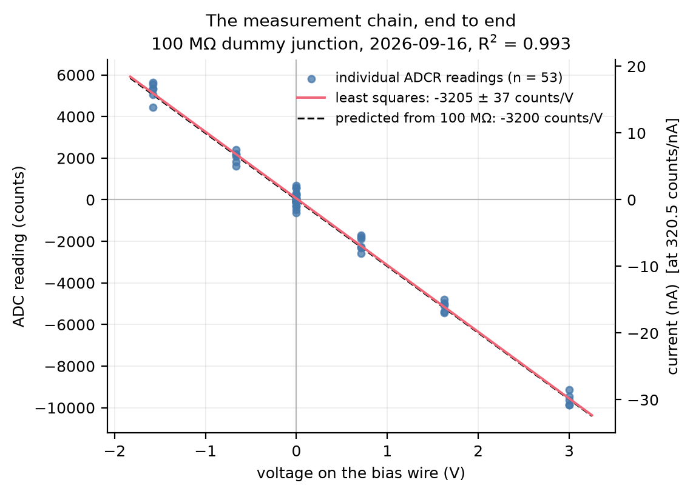

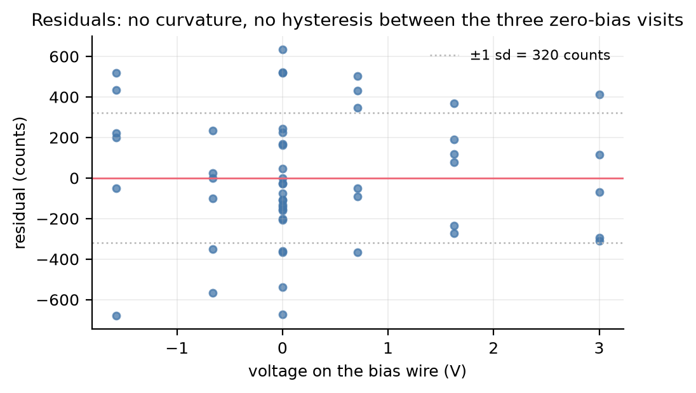

---

## 2. The Z tests: 110 cycles, and what they say about the junction

**What was done, 2026-09-19 morning.** With a contact found, Z was walked toward the sample four
counts at a time until the current reached 1,000 counts, then walked back out. That cycle was
repeated 30 times at sample −0.5 V and 20 times at each of −0.1, +0.5, +0.1 and −0.5 V again:
**110 cycles in nine minutes — 12:56 to 13:05, both timestamped in the session log — one tip, one
sample.**

Three numbers come out of each cycle:

- **Counts per decade** — how far Z must move for the current to change tenfold. A vacuum tunnel
  gap changes tenfold per 1–2 Å.
- **Hysteresis** — the Z at which the current first appeared going in, minus the Z at which it
  finally vanished coming out. Zero for a clean gap. Positive means the current *persisted further
  out*, which is what happens if the sample sticks to the tip and follows it back.
- **Onset drift** — where the contact is, cycle by cycle, against time.

### 2.1 Every published number reproduces

`code/ztest_analysis.py` re-implements the definitions from scratch, reading the CSVs directly and
never importing the bench script. **All 25 comparisons match:**

| Run | Cycles | Counts/decade in | out | Hysteresis | Watchdog | Drift |
|---|---|---|---|---|---|---|
| −0.5 V run 1 | 30 | 1,650 | 3,442 | +1,162 | 3 | −74 counts/s |
| −0.1 V | 20 | 808 | 4,839 | +1,653 | 0 | +29 |
| +0.5 V | 20 | 2,243 | 4,975 | +1,868 | 1 | +22 |
| +0.1 V | 20 | 4,639 | 12,595 | +1,474 | 0 | +7 |
| −0.5 V repeat | 20 | 1,967 | 3,834 | +705 | 0 | +83 |

That is a real check, not a formality: it means the figures in `STATUS.md` and `docs/FACTS.md` are
what the raw files contain, computed two different ways.

**One correction to `docs/FACTS.md`, for the lead to action.** That file states the per-cycle
counts-per-decade range across all runs as **233–22,990**. The true minimum is **208.3**, from
cycle 1 of the −0.5 V repeat run. The maximum, 22,990, is right. This is a small imprecision in a
live document, and this analysis is not permitted to edit `docs/FACTS.md`.

**A second, smaller one.** `sessions/2026-09-19-morning.md` §3.11 reads *"10 of 109 cycles at
+0.5 V were negative"*. **10 of 109 cycles across all five runs are negative; only 1 of them is at
+0.5 V.** The count is right, the attribution reads wrong. Session logs are history and are not to
be rewritten; this is noted so nobody quotes the sentence as written.

### 2.2 This is not a tunnelling gap

**MEASURED.** A decade of current takes **808 to 4,639 Z counts going in**, depending on bias. On
the inherited Z scale, vacuum tunnelling would take **6 to 13**. That is a factor of **60 to 750**.

**The comparison depends on an ASSUMED number** — the 0.016 nm per Z count is Berard's calibration
of a similar piezo disc, not ours, and `docs/OPEN_QUESTIONS.md` records it as unmeasured. So the
honest statement is: *either the junction is not a vacuum gap, or Z moves the tip 60 to 750 times
less than assumed.* The next result decides between them without needing the scale at all.

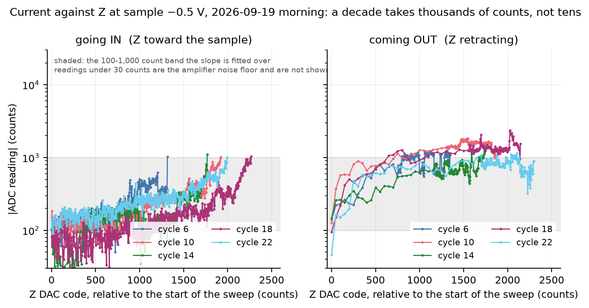

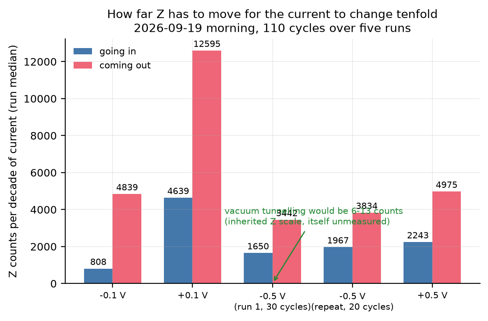

### 2.3 The hysteresis, which needs no scale

**MEASURED.** In every one of the five runs the current persisted further out than it began in.
Run medians: **+1,162, +1,653, +1,868, +1,474 and +705 Z counts.** All five positive. Per cycle,
**99 of 109 cycles are positive**.

This does not depend on the Z scale, because it is a difference between two Z codes in the same
units. **A clean tunnelling gap gives zero.** A contact that sticks and follows the tip back gives
exactly this sign and this size.

**n = 5 independent runs; the 109 cycles are repeated measurements inside those five.**

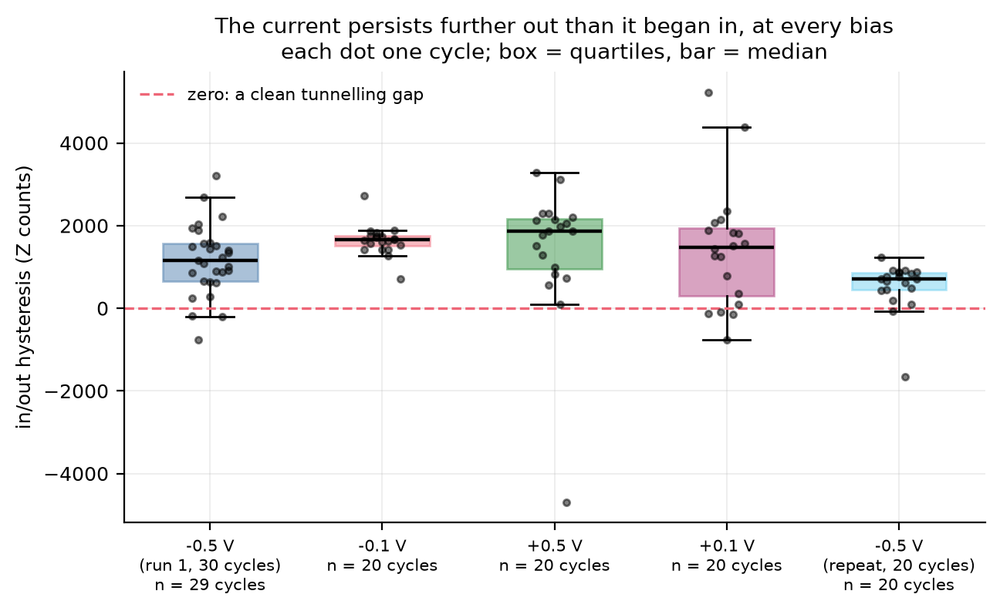

### 2.4 It is not the bias pulling the sample in

**The test.** If the sample were being pulled toward the tip by the electric field, the force would
scale as **V²**, so ±0.1 V should give **25 times less** hysteresis than ±0.5 V.

**MEASURED.** ±0.1 V gives run medians of **+1,653 and +1,474** (mean 1,564). ±0.5 V gives
**+1,162, +1,868 and +705** (mean 1,245). The ratio is **1.26**, where V² scaling predicts 0.04.

**It does not shrink. If anything it is slightly larger at the lower bias**, which is the opposite
of the electrostatic prediction. Pooling the cycles, the ±0.1 V median is 1,611 counts against
±0.5 V's 906 (Mann-Whitney two-sided p = 0.021).

**Do not read that p value as strong.** The cycles inside a run are repeated measurements of the
same contact, not independent samples, so the real uncertainty is wider than any test on 109
cycles suggests. **The n that matters is 2 independent runs at ±0.1 V against 3 at ±0.5 V.** What
the data support is: *the hysteresis certainly does not fall by the factor of 25 that the applied
bias would demand*. Whether it genuinely rises is not established.

**What this does NOT rule out.** The contact potential between a tungsten tip and a gold sample is
**unmeasured**, and it adds to the applied bias. If it is several hundred millivolts, the field at
"±0.1 V applied" is not five times smaller than at "±0.5 V applied" and the V² argument is blunted.
`STATUS.md` records this caveat and it stands.

### 2.5 Contact begins gradually, not with a snap

**MEASURED.** Across the 110 cycles, **exactly one onset** went from below 100 counts to above
1,000 counts in a single 4-count Z step: cycle 1 of the −0.5 V run, 10.4 → 9,116 counts at Z
41,260 → 41,264. **109 of 110 were gradual.**

The excluded 12:50 run has one too — the 28.6 → 16,777 in four counts at t 9.68 s — but that run is
excluded because the sample was moving through the whole of it.

This matters because "it is a snap-in" was a leading hypothesis on 2026-09-18, from the fast-tracker
data. The Z test is the better measurement and it says the opposite: **a soft, gradual contact.**

### 2.6 The junction changes while you watch it

**MEASURED.** Within a single run the counts-per-decade drifts by a factor of **1.0 to 2.4**
between the first third and the last third of the cycles, and the per-cycle values across all runs
span **208 to 22,990**. The two runs at the same bias — the first timestamped 12:56 and the bias
series running 12:59–13:05, so about eight minutes apart — agree to about 20 % in counts per decade
(1,650 against 1,967) but differ by a factor of 1.6 in hysteresis (1,162 against 705).

**The junction is not the same junction twice.** Any single-number description of it is a median
over something that is moving.

---

## 3. Gap stability: the blocker, quantified

### 3.1 The headline measurement

**MEASURED, `release_watch_run1.log`, 2026-09-19 morning 12:54–12:56.** The tip was released and
then, with **the motor and hands still and only the piezo sweeping**, the whole Z range was swept
every three seconds to find where the contact was:

| Time after release | Where the contact was |
|---|---|
| 0.1 s | Z 19,000 |
| 3.2 s | Z 42,000 |
| 6.4 s | **beyond Z 62,000 — out of reach** |
| 111.1 s | Z 6,000 |
| 114.1 s | Z 7,000 |
| 117.1 s | Z 6,000 |
| 120.2 s | beyond Z 62,000 |
| 126.4 s | Z 7,000 |
| 129.4 s | Z 8,000 |

**MEASURED**, from the two found points: **+23,000 counts in 3.1 s = +7,419 counts per second.**
**DERIVED lower bounds**, because "beyond 62,000" is a bound and not a position: **≥ 43,000 counts
in 6.3 s**, and **≥ 56,000 counts back over 111 s**. Both reproduce what `STATUS.md` and
`docs/FACTS.md` carry.

**n = 1 episode, 9 sweeps.** This is one observation of a recession and one of a return. It is not
a rate that has been measured repeatedly, and it should not be quoted as one.

**A limit on resolution.** The sweep ran in **1,000-count Z steps**, not the 250 its script set — a
default-argument bug found in the write-up verification and recorded in
`sessions/2026-09-19-morning.md` §8. Every onset above is a multiple of 1,000.

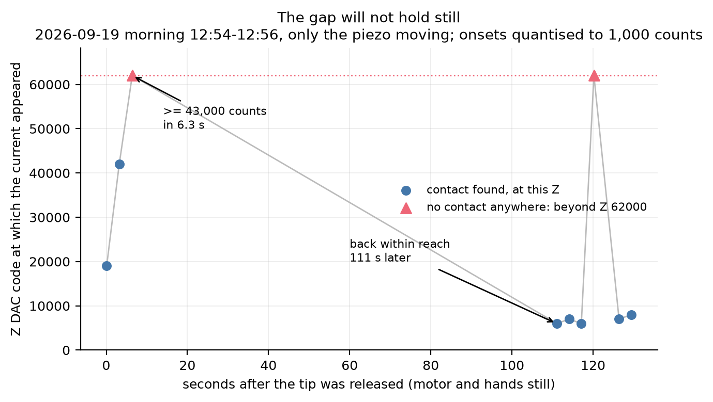

### 3.2 A second, independent record of the same size of motion

**MEASURED, `track_run1.csv`, 2026-09-18, a different tip and a different sample.** 276 repeated
onset searches over 90 seconds with **the motor still**: an onset was found in 249 of them, mean
**24,067**, sd **7,563**, range **7,250 to 44,250** — a spread of **37,000 Z counts in 90 seconds.**
(The session log reports mean 24,067 and sd 7,548; the small difference is sample against
population standard deviation.)

**This is the control that makes the rest of the motor work interpretable**, and it is worth saying
plainly: *before anything moves the motor at all, the apparent position of the sample already
wanders over most of the Z range.*

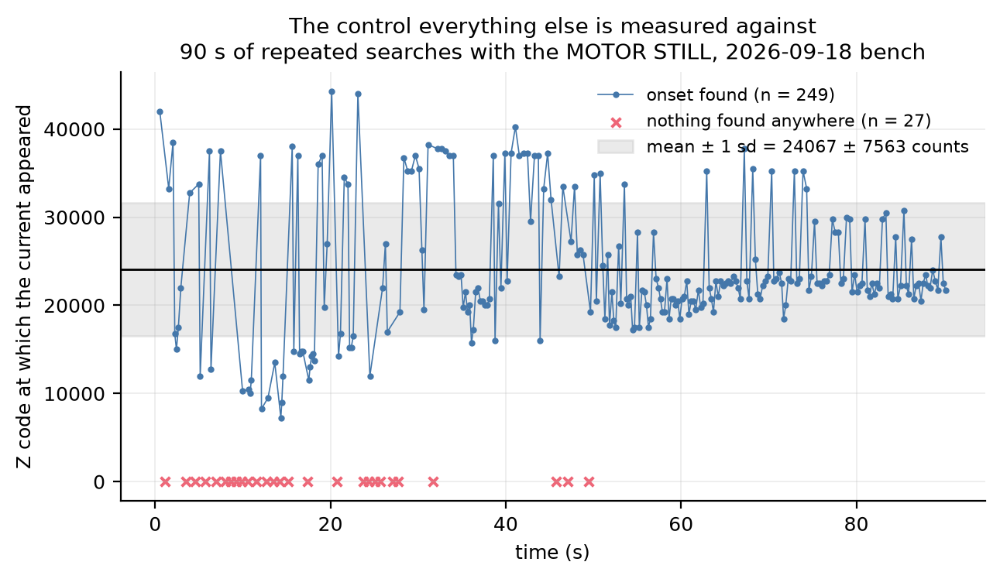

### 3.3 Drift inside the Z-test runs is a hundred times slower, and that is not a contradiction

**MEASURED.** Onset drift across the five Z-test runs: **−74, +29, +22, +7 and +83 counts per
second** (mean +13, sd 57). Four of the five are positive, meaning the tip had to reach further
each cycle.

That is two orders of magnitude slower than §3.1. **The two are different regimes, not a
conflict**: in a Z test the tip is in or near contact for most of the run, and the log's own
reading is that the sample sticks to and follows the tip. In the release-watch the tip had just
been let go and was clear.

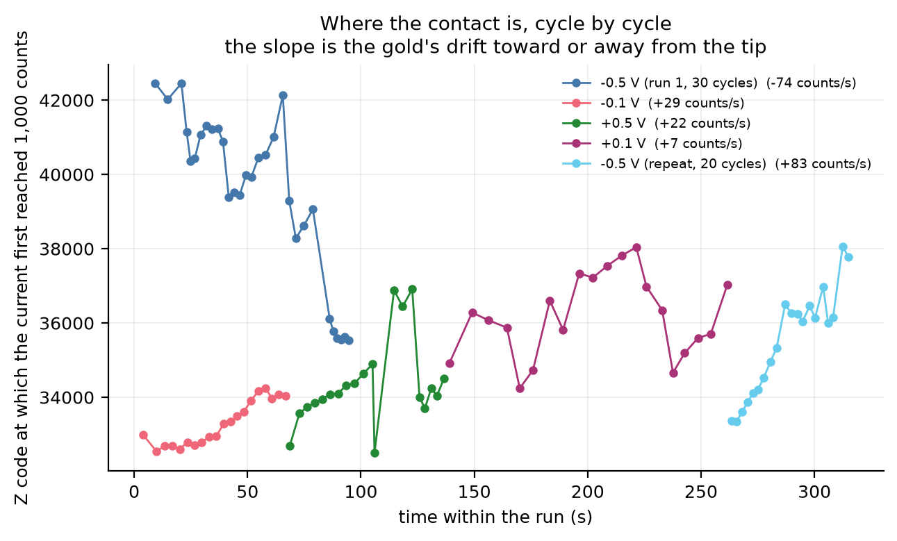

### 3.4 Is it periodic? Nothing says yes, and nothing can say no

Jacob asked this at the bench on 2026-09-19 — the idea being to synchronise the scanner to the
motion — so it is worth answering carefully.

**The only fast record of a live junction in the repository** is `here_run1.csv`: **35,000 readings
over 10.3 s at about 3,400 per second**, at a fixed Z with a real junction. Mean 1,059 counts
(3.30 nA), sd 95.8 — identical to the session log's 1,059 and 96.

**MEASURED, split-half test.** Take the spectrum of the first five seconds and of the second five
seconds separately. A real line sits at the same frequency with a similar height in both. Of the
twelve strongest peaks in the first half, **four are within a factor of 1.43 in the second** (1.4,
2.0, 2.9 and 3.9 Hz) and eight are not. On a stronger four-way split, **nothing is steady**,
including the 60 Hz mains line, whose amplitude is only about 3 counts against a 1.1-count floor.

**Multiple comparisons, stated because it changes the reading.** Twelve peaks were examined out of
**1,960 frequency bins**, and they were chosen *because* they were the largest in the first half.
That is a biased test: the largest value in a noisy half is partly noise and tends to fall back.
**"Survives the split" is necessary, not sufficient.** Nothing here should be called a line except
mains, which physics predicts independently.

**The real limitation is not statistical.** The record is 10.3 s long, so its lowest resolved
frequency is about **0.1 Hz**. The gap moves on a timescale of **tens of seconds to minutes**. The
position records that cover that timescale are one sweep per 3 s at best, nine points in total.
**No measurement in this repository can either find or exclude a period in the gap's motion.**

`sessions/2026-09-19-morning.md` §6 reached the same conclusion by a different route. This
re-derivation agrees with it and adds the multiple-comparison arithmetic.

**A fourth record of the gap's position exists and is in §6.4b** — the onset Z of each of the five
three-Y runs, all inside one ~5-minute window on the night before. It gives 7,800 counts of motion
across the five and **at least 7 counts per second** between runs 2 and 4. **All four records
measure the GAP; none measures LATERAL position**, and lateral drift has never been measured here.

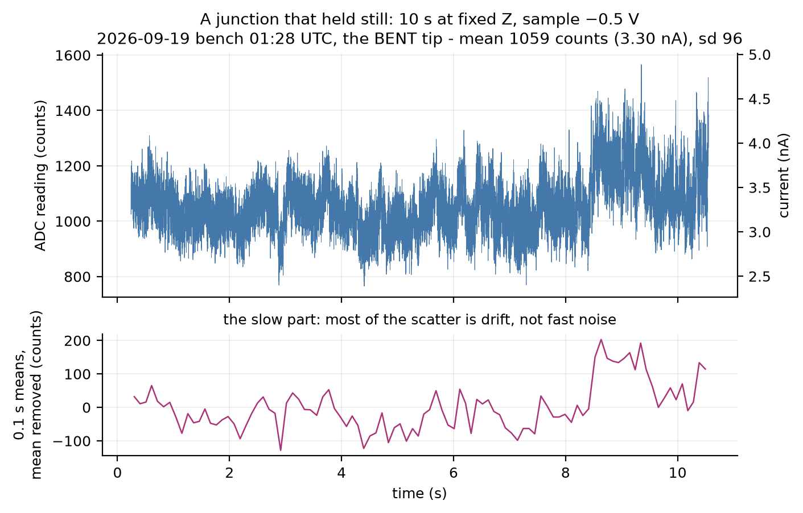

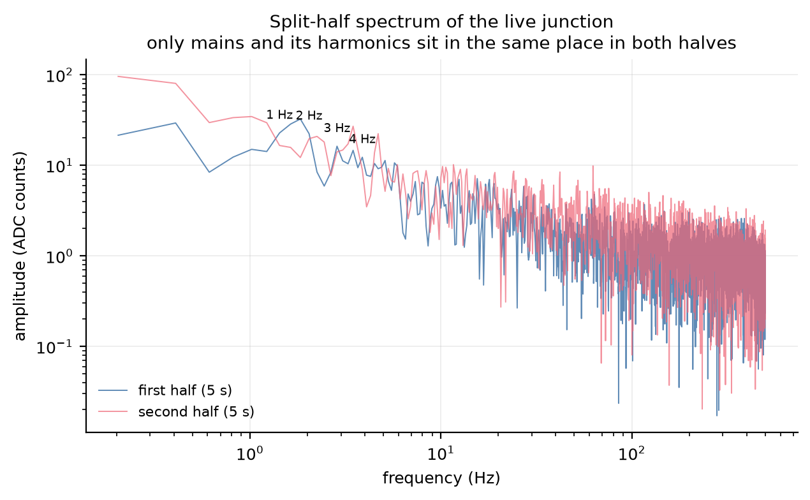

---

## 4. Noise

### 4.1 The still-versus-stamping pair — the only clean A/B in the noise record

**MEASURED, re-derived from the raw samples.** Ten seconds each, 36 seconds apart, tip clear:

| | `still.csv` | `stamp.csv` |
|---|---|---|
| Readings | 34,746 | 36,071 |
| Standard deviation | **41.80 counts** (0.130 nA) | **42.35 counts** (0.132 nA) |
| 2–10 Hz above this run's own white floor | 0.27 | 0.28 |
| 10–30 Hz | 0.31 | 0.24 |
| 30–100 Hz | 0.33 | 0.26 |
| 100–400 Hz | 0.18 | 0.19 |
| 400–1600 Hz (the control band) | −0.08 | −0.07 |

The session log reports 42 for both; 41.8 and 42.3 is the same measurement carried to one more
digit. **The difference is +0.55 counts, 1.3 %, and no band shows an excess** — including the low
bands where floor vibration would appear. The control band comes out at zero, which is what it
should do and is a check on the method.

**WHAT THIS CAN AND CANNOT SAY, and it is easy to over-read.** Both files were taken **with the tip
clear**. There was no junction, so there was nothing for floor vibration to modulate. The result
therefore rules out **electrical and microphonic pickup of the stamping, and nothing more.** It
does not show that the building stays out when a gap exists. The session log says this itself; it
is repeated here because this is the pair most likely to be quoted.

**n = 1 independent observation per condition.**

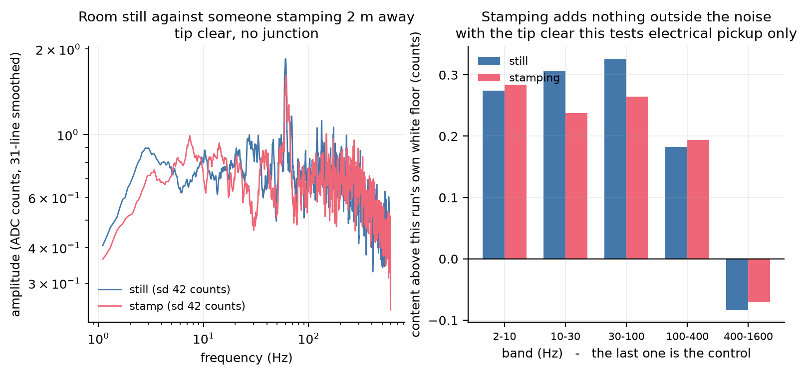

### 4.2 Which noise figure belongs to which night

The single most confusable set of numbers in the project. All are the scatter of `ADCR`, the
firmware's averaged read; **320.5 counts is 1 nA**.

| When | sd | Tip | Junction? |
|---|---|---|---|
| 2026-09-17, room empty | 46 | blunt placeholder | clear |
| 2026-09-18 01:47–01:59 | **341–350** | same, holder rebuilt | clear |
| 2026-09-19 bench 01:01–01:08 | 40–42 | the **bent** tip | clear |
| 2026-09-19 bench 03:05 | 34–36 | the new blunt tip | clear |
| 2026-09-19 morning 11:22 | 33.5–37.1 | the new blunt tip | clear |
| 2026-09-19 morning 12:11 | 46.3–46.5 | the new blunt tip | **junction at Z 20,000** |

**Safe to compare:** the five tip-clear rows. 2026-09-18 is about **eight times** its neighbours on
either side, and the excursion went away. It was ruled out as the operator (identical at 76 cm and
with the room empty) and showed no decay over 16 minutes. Its cause was never found; the candidates
left open are the rebuilt holder and the new whole-plate gold.

**Not safe to compare:** the last row with any of the others. A junction is a current source; a
tip-clear reading is the instrument's own floor.

**A different quantity that is often confused with these:** the **height-channel wobble** — 287–419
counts RMS on 2026-09-17 with the loop holding at one fixed point, against 9–19 counts on
2026-09-19 with a junction and **X held**. Those are Z DAC counts, not ADC counts, and the two
conditions are not the same. `Code/pc/stm_y_control.py` still prints the 2026-09-17 figure as its
comparison, which `sessions/data/2026-09-19-bench/README.md` flags.

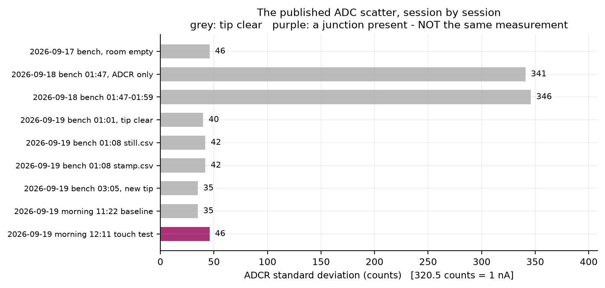

---

## 5. The I-V curve, and the limit of what a shape can prove

**MEASURED, `here_run1.csv`, 2026-09-19 bench 01:28 UTC, Z 0.** 21 bias settings, 32 readings each.
**Taken with the tip Jacob identified as BENT about ninety minutes later**, so nothing in it
transfers to the tip fitted at ~03:00.

**Exclusions, stated before any fit.** At sample −0.9 V all 32 readings sat at the converter's
+32,767 rail and at −1.0 V eight of 32 did; the +1.0 V point has a standard deviation of 6,008
counts across its 32 readings, which means the junction was changing during it. **Four of the 21
points are excluded** and the fits use |V| ≤ 0.8 V.

**MEASURED: it is a junction, not a leak.** The bias flip is the control that settles this —
sample −0.5 V reads **+1,156 counts**, +0.5 V reads **−811**, 0 V reads **−1.4**, and back at
−0.5 V it reads **+1,033**, each over 256 readings. The reading follows the sign of the sample
voltage, which noise and amplifier offset cannot do.

**MEASURED: it is superlinear on both polarities.** Fitting each side as a power law I ∝ |V|^p:
**p = 1.98 ± 0.25** sample-negative and **1.48 ± 0.15** sample-positive, against p = 1 for an
ohmic contact. Resistance from the ±0.1 V points alone: **181 and 193 MΩ**, matching the session
log's ~190 MΩ.

**MEASURED: it is asymmetric.** At 0.1 V the two polarities differ by 7 %; at 0.8 V by a factor of
**3.6**, sample-negative larger.

**DERIVED: a symmetric barrier does not describe it.** Fitting the Simmons low-bias form
I = aV + bV³, which is symmetric by construction, gives R² 0.748 against 0.675 for a straight line
— the cubic term is worth its degree of freedom (F = 4.3 on 1 and 15) but the fit is mediocre
*because the curve is not symmetric*.

**WHAT THIS DOES NOT PROVE.** A barrier-shaped I-V is **not** evidence of vacuum tunnelling. A tip
resting on the gold through a thin oxide or contamination film gives the same superlinear,
asymmetric shape, and a new tungsten tip carries an oxide unless it is etched. The session log says
this in the same paragraph as the measurement. **The Z tests of the next morning are the
measurement that discriminates, and they point at the pressed contact.**

**One more thing from the same file, MEASURED:** sweeping Z from 0 to 3,000 counts at fixed bias
made the current **fall** — a straight-line fit of log₁₀(current) against Z gives a negative slope,
about 18,000 counts per decade, R² 0.63 over 301 points. The session log calls it "~2000 falling
slowly to ~1400 — no rise". This was one of the pieces of evidence that the Z direction was
unresolved for the bent tip; it was settled the other way for the replacement.

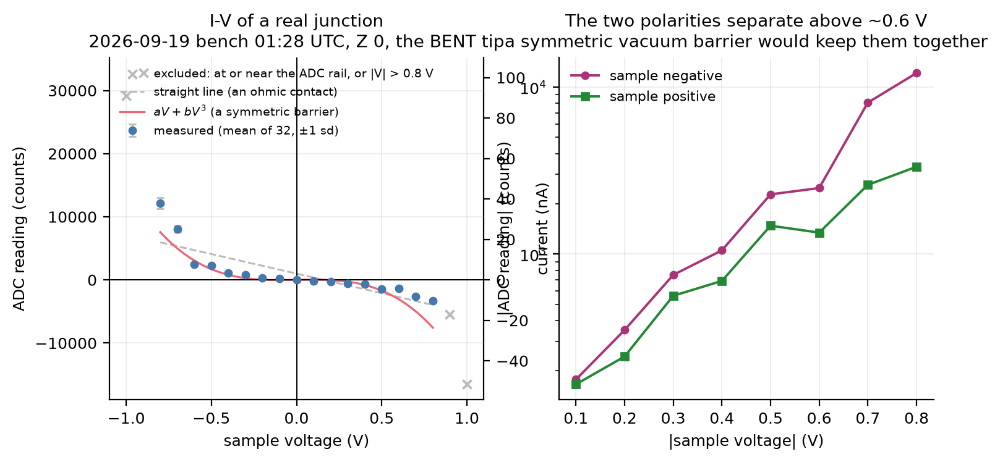

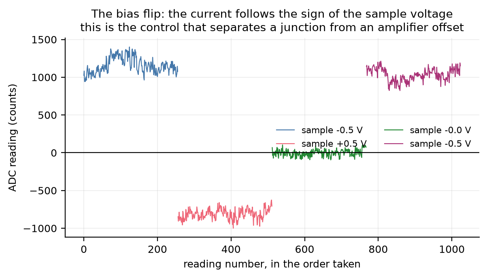

---

## 6. Imaging: every scan measured against its own control

**The method.** Each line is detrended (the tilt removed), then three numbers: **corrugation** (the
RMS of a detrended line), **trace/retrace** (forward against backward, line by line) and
**image-to-image** (one detrended forward image against the next). **An X-held control** is a run
with identical timing in which X never moved — so anything it shows is the loop, the junction or
the drift, and not the surface.

`code/scans_and_controls.py` re-implements this independently of
`sessions/data/2026-09-19-bench/scripts/analyze_scans.py`.

### 6.1 The `cas9` set, the cleanest comparison in the repository — and a figure I got wrong

**Four feedback scans, each immediately followed by an X-held control, same tip, same night, same
loop tuning.** Trace/retrace and corrugation reproduce the session log exactly:

| | Scans | X-held controls |
|---|---|---|
| Trace/retrace | −0.10, +0.43, −0.45, −0.07 | −0.38, −0.05, +0.12, +0.31 |
| Corrugation | 82, 126, 147, 101 counts | 82, 41, 237\*, 59 counts |

\* `cas9_xheld2.csv` aborted after **one** line; its 237 is one line, not eleven.

> ### CORRECTION — "the controls reproduce better at +0.37" is WITHDRAWN
>
> **This was my error, and it is the same defect I found in the wide images and then failed to look
> for anywhere else.** `analyze_scans.py` (lines 50–51) truncates each image pair to the shorter
> file **with no shape check**. `cas9_xheld2.csv` is a **single scan line** — one y value, forward
> and back — where the other seven carry eleven. **Two of the three control correlations were
> therefore computed over 21 points instead of 231**, and 21 points is one line: the line that is
> guaranteed to agree, because it carries the loop's settling transient (§6.2).
>
> **Found by the lead's independent review, not by me.** `STATUS.md` is already corrected and the
> full write-up is in `deliverables/2026-09-19-pause/LEAD_VERIFICATION.md` V4.

**Like for like, complete images only:**

| | n pairs | Image to image | |
|---|---|---|---|
| Real scans (X moving across the surface) | 3 | +0.09, +0.18, −0.15 | **mean +0.039** |
| X-held controls (tip never moved across it) | 2 | +0.20, −0.06 | **mean +0.068** |

The standard error of each correlation at 231 pixels is **0.066**, and that is optimistic — it
treats the 21 pixels of a line as independent, which the Z ramp along a line makes false.
**Difference −0.030 against a standard error of 0.066: indistinguishable. Neither mean differs
from zero.**

**The correct statement: neither the scans nor the controls reproduce, and the scans show no more
repeatable structure than a control in which the tip never moved across the surface.**

**The imaging conclusion is unchanged and needs no rescuing.** It never rested on the controls
being better; it rests on the real scans not reproducing, and they do not.

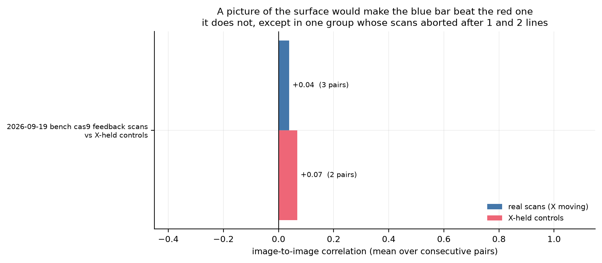

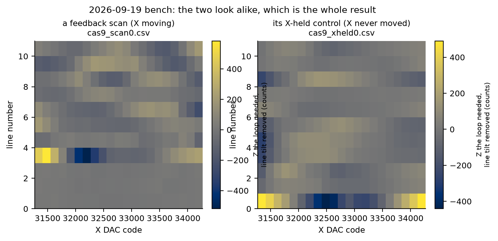

### 6.2 The first-line trap, reproduced four times

The 2026-09-17 session found that its images correlated at r = +0.75 and that **the whole agreement
was the feedback loop's settling transient on line 1**, which is identical in every image because
the procedure is identical. This analysis reproduces that on every 2026-09-17 narrow group:

| Group | All lines | Drop line 1 | Drop lines 1–2 |
|---|---|---|---|
| 4 fast images | +0.70 | +0.14 | **−0.08** |
| 2 slow images | +0.75 | +0.22 | **+0.04** |
| 250 corrections per pixel | +0.62 | −0.27 | **−0.29** |
| 15 corrections | +0.71 | −0.42 | **−0.45** |
| wide ±4,000 X | +0.38 | −0.17 | **−0.26** |

The 2026-09-17 log's own figures (+0.22 and +0.04 for the slow pair) come back identical. **This is
a mechanical check anyone can run, and any future image should be put through it before it is
believed.**

### 6.3 The truncation defect is a CLASS, and it is in four groups

**`analyze_scans.py` lines 50–51 truncate each image pair to the shorter file with no shape
check.** Where one file of a pair aborted, the resulting "image-to-image correlation" is computed
over one or two **lines** while a complete pair is computed over eleven. Those are not the same
statistic, and the short one is dominated by the first line, which is the line guaranteed to agree
(§6.2).

**I found this in the wide images and did not sweep the class.** `CLAUDE.md` §7.1 says a defect is
a class, not an instance, and to grep for every other occurrence before reporting it fixed. Doing
that now: **four groups are affected, on both the scan side and the control side.**

| Group | Side | Published (truncating) | Complete images only |
|---|---|---|---|
| `cas9` | controls | +0.20, +0.21, +0.70 → **+0.37** | +0.20, −0.06 → **+0.07** |
| wide images | scans | +0.86, +0.56 → **+0.71** | **no pair of complete images exists** |
| tuned scans | scans | −0.75, +0.26 → **−0.25** | **no pair of complete images exists** |
| tuned scans | controls | +0.22, −0.15 → **+0.03** | **no pair of complete images exists** |

**Every image-to-image figure in this document is now computed over complete images only**, with
the truncating version printed beside it by `code/scans_and_controls.py` so the difference is
visible rather than silently corrected.

**For the wide images the honest answer is stronger than the one I gave before.** Only `img_scan_2`
ran to the end; `img_scan_0` holds **one** forward line and `img_scan_1` holds **two**. **There is
no pair of complete wide images to compare at all.** The +0.71 once quoted came entirely from a
single shared line. The same is true of the tuned scans on both sides.

Two things still stand against those wide scans independently of any correlation:

1. **Trace and retrace are strongly anti-correlated in all three** (−0.94, −0.91, −0.75) and
   **not** in the controls (+0.14, +0.13). A surface is traced the same way in both directions and
   gives a **positive** trace/retrace; `sessions/2026-09-19-morning.md` §6 reads the negative one
   as the loop hunting, with X motion the likely but unproven cause.
2. **There is no `.log` file** for these runs, so the "14.5 % saturation" quoted in the session log
   came from console output that was not saved and cannot be checked. `cas9.log` does carry the
   loop's own saturated and clamped counters, which is why that group can be audited and this one
   cannot.

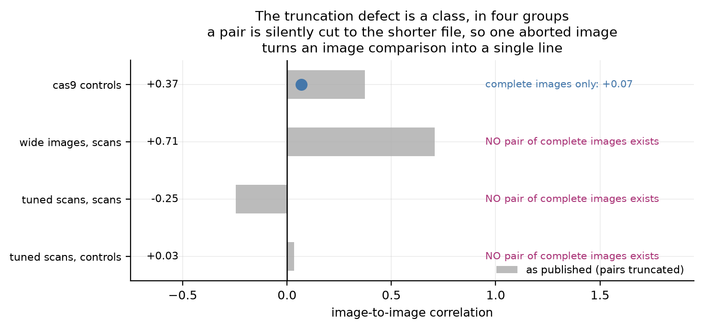

### 6.4 The three-Y control, and the statistic that fires on a control

**The test.** Does one place on the sample look more like *itself* than like a place 3,000 or
12,000 Y counts away? A surface says yes.

**MEASURED, and all five runs reproduce the published figures to the third decimal:**

| Run | Y sep | X moving? | Within | Between | Difference |
|---|---|---|---|---|---|
| run 1 | ±3,000 | yes | +0.713 | +0.680 | +0.032 ± 0.035 |
| X-held | ±3,000 | **NO** | +0.278 | +0.114 | **+0.164 ± 0.082** |
| run 2 | ±12,000 | yes | +0.239 | −0.135 | **+0.374 ± 0.096** |
| run 3, X-held | ±12,000 | **NO** | +0.116 | +0.046 | +0.070 ± 0.083 |
| run 4, repeat of 2 | ±12,000 | yes | +0.149 | +0.093 | +0.056 ± 0.093 |

**Five tests, two positives — and one of the two positives is an X-HELD CONTROL**, in which X never
moved and there is therefore no surface to see. **A statistic that fires on a run with no lateral
motion is biased in this data**, and the same bias is available to the run that fired with X
moving. Run 2's +0.374 and its repeat run 4's +0.056 are the same measurement, taken a few
minutes apart.

> **CORRECTION to an interval I asserted without evidence.** This document previously said run 4
> came "nine minutes" after run 2. **Neither `ycontrol` log carries a timestamp**, so no interval
> between them is recorded. What the record does bound: `sessions/2026-09-19-bench.md` is
> chronological, §3.14 is timestamped **03:48**, §3.16 is timestamped **03:53**, and §3.15 — **all
> five** three-Y runs — sits between them. **All five fit inside about five minutes.** The interval
> between any two of them is UNKNOWN. Found by the lead's independent review.

**Multiple comparisons:** five tests at a two-standard-error threshold would be expected to throw
about 0.2 false positives by chance *if the measurements were independent*. The passes within a run
are **not** independent — every pass appears in many of the 45 within-place and 108 between-place
pairs — so the printed standard errors are too narrow and the "3.9σ" once quoted for run 2 is
overstated.

**Subagent 2 measured how much, at this pause point**, with a 20,000-fold permutation of the place
labels (`deliverables/2026-09-19-pause/candidates/VERDICT.md`, carried into `STATUS.md`): **run 2 is
p = 0.0036, and an X-held control — which cannot contain a surface — scores p = 0.020 on the same
statistic.** Against a Bonferroni threshold for the 201 reproducibility tests run across this data
(p < 2.5 × 10⁻⁴), run 2 is a factor of 14 short. **Use the permutation test, not the printed
sigma.** That figure of 0.020 for a control is the empirical false-positive rate of this
measurement on this instrument, and it is the single most useful number in this section.

### 6.4b Where the gap was during those five runs — a measurement nobody had used

**MEASURED, and it was sitting in the logs all along.** The first line of every `ycontrol_run*.log`
records the Z at which the loop found the surface before that run started. Nobody in this project
has used it, and it is the only series of gap positions taken inside one short window.

| Run | What it was | Onset Z |
|---|---|---|
| `ycontrol_run1` | ±3,000 Y, scanning | 44,200 |
| `ycontrol_xheld_run1` | ±3,000 Y, X held | 47,000 |
| `ycontrol_run2` | ±12,000 Y, scanning | **48,600** |
| `ycontrol_run3` | ±12,000 Y, X held | 52,000 |
| `ycontrol_run4` | ±12,000 Y, the repeat of run 2 | **50,800** |

**Across all five the onset moved 7,800 counts. Between run 2 and its repeat, run 4, it moved
+2,200 counts** — **3.4 %** of the 65,536-count Z range and **4.6 %** of the 12,000–60,000 window
the loop was given for these runs.

**THIS DOES NOT GO THE WAY THE PROJECT ASSUMED, and it weakens the candidate rather than rescuing
it.** The standing explanation for run 2 not reproducing in run 4 is that the surface moved out
from under the scanner. **Across exactly that interval the gap moved a few per cent of the range,
not most of it.** So "the surface moved" is a *poorer* explanation for the non-reproduction than it
looked.

**IT DOES NOT CLOSE IT, and the reason matters.** Onset Z measures the **gap**, not **lateral
position**. A sideways drift would carry the tip to a different patch of gold while barely changing
the Z at which it finds the surface. **Lateral drift has never been measured in this project**, and
nothing in `sessions/data/` can measure it.

**The rate, bounded rather than measured:** 2,200 counts over an interval of at most the ~5 minutes
that hold all five runs, so a mean of **at least 7 counts per second**. Compare the Z-test onset
drifts of −74 to +83 counts/s (§3.3) and the release-watch's ≥ 7,400 counts/s (§3.1). It sits at
the quiet end, which is consistent with §3.3's reading that the gap moves far more slowly while the
tip is in or near contact.

**Credit: the lead's independent review pointed out that this series existed and was unused.**

### 6.5 What is unusable, and why

- **The nine `cas8` constant-height maps are entirely at the ADC rail** — every pixel of every one,
  32,767 counts. They carry no information about the surface. Their forward and backward passes are
  identical *because both are pinned*, which is physical, not a tool defect.
- **`diag_line_repeated.csv` and `line_repeated_wide.csv` store the forward pass twice.** Every
  `fwd`/`back` pair is byte-identical. Any trace-versus-retrace figure from them is meaningless.
  This was found by an independent review of the committed data on 2026-09-17 and is recorded in
  that log; it is reproduced here mechanically. Using forward passes only,
  `line_repeated_wide.csv` gives consecutive-pass r **+0.515** and odd-average against even-average
  **+0.923** with an averaged profile amplitude of **645 counts** — the log's +0.515, +0.923 and
  636 counts. **That 636-count profile is the project's best candidate image and it is now CLOSED,
  by subagent 2 at this pause point** (`deliverables/2026-09-19-pause/candidates/VERDICT.md`,
  carried into `STATUS.md`): it is the feedback loop recovering from the **30,000-count X flyback**
  between passes on a surface tilted at −0.105 Z counts per X count, which predicts a **3,144-count
  Z error at every pass start**; **dropping two pixels of twenty-one takes the consecutive-pass
  correlation from +0.65 to +0.05**, and the same arithmetic correctly predicts the artefact's
  *absence* in the two 2D wide images, which raster without lifting X. That is a falsification with
  a mechanism, not a null.
- **All six tuned scans of 2026-09-19 morning aborted at a Z clamp**, with 21–64 % of their pixels
  sitting on one.
- **20 of the scan-shaped files carry at least one data-quality flag** (aborted, clamped, or
  duplicated passes). They are listed in `DATA_INVENTORY.md`.

---

## 7. The coarse approach: why the motor cannot get a gap

**MEASURED, across three sessions and two tips.**

| Evidence | What one motor step did |
|---|---|
| `zcal3_run1`, 2026-09-18 | steps 0–23: nothing anywhere up to Z 50,000. Step 24: a clean onset at Z 28,500. Step 25: full scale at Z 9,250. Step 26: full scale at Z 0 |
| `lash_run1.log`, 2026-09-18 | 21 single approach steps with the tracked median unmoved — **20 of 21** between 14,400 and 18,000 counts, the one exception 27,600 — then a jump |
| `2026-09-19-bench` §3.13 | **pinned for 23 retract steps, clear on the 24th, no moderate current in between**; and a 5-step approach cycle went from out of reach to metal contact |
| `fastwood`, 2026-09-19 morning | **650 single steps toward the sample: nothing at all.** 20-step chunks then found it twice, at 200 and 180 steps |

**THE CONCLUSION THAT SURVIVES ALL OF IT, and it needs no Z scale: between "nothing anywhere" and
"metal contact" there is no motor setting.** The motor cannot park the tip at a moderate current;
the piezo has to do the last part, and the piezo's whole range is smaller than the sample's own
wander (§3).

**Against the still-motor control (§3.2, sd 7,563 counts):** a step that moves the onset by
14,000–29,000 counts is **1.9 to 3.8 times** the still scatter, so *those* steps did something. The
smaller step-to-step wander is inside the still scatter and **is not evidence that the motor moved
anything**.

**Backlash and release, n = 8 independent episodes:** motor retraction cleared a hard contact **3
times out of 8**. `+2,927`, `+1,200`, `+380` and `+83` retract steps all failed at least once; the
hand on the side screws released three of the four hard contacts on 2026-09-19 morning.

**NOT ESTABLISHED: that chunks work better than single steps.** Eleven hand nudges happened between
the 650-single-step failure and the 20-step-chunk successes, so the comparison is confounded. The
session log says this itself.

**The length of a motor step remains unmeasured.** `docs/FACTS.md` carries 3.88 / 5.17 / 7.75 nm
for lever ratios of 40 / 30 / 20, all DERIVED from CAD geometry. The 2026-09-17 bench figure of
"250 Z counts per motor step" was declared SUSPECT the next night because the staircase that
produced it ran inside its own 100–250 steps of measured slack, and nothing has replaced it.

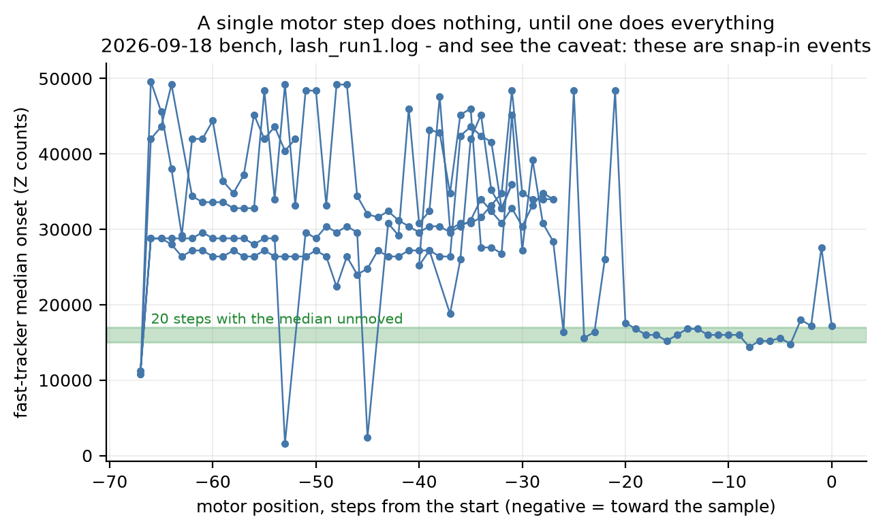

---

## 8. Useful operating conditions, and the failure modes that recur

Observations, not bench instructions — `docs/NEXT_SESSION_PLAN.md` is the only place that says what
to do at the bench.

| Condition | Evidence |
|---|---|
| **Sample at −0.5 V (`BIAS 38229`)** gave the steepest current-versus-Z of the four biases tried | Z tests: 1,650 and 1,967 counts per decade at −0.5 V against 4,639 at +0.1 V |
| **The live back-off is the coarse approach that works** — the laptop ticks while the tip touches and falls silent when it clears | 5 hand-sets on 2026-09-19 morning all reached "clear"; the motor reached it 3 times in 8 |
| **Holding Z at 0 during the back-off, not midscale**, leaves the whole piezo range available afterwards | `live_backoff_z0.py`'s own reasoning, and the 11:24 failure it was written to fix |
| **`ADCR`, not a single conversion** — four times quieter for the same time | 46 counts against 188, measured 2026-09-17 |
| **Take an X-held control after every scan** | It is the measurement that has settled every imaging question in this project |
| **Warm-up: about two minutes, not 45** | The 45-minute rule was RETIRED on 2026-09-15; note the minutes since power-on with any noise figure anyway, so runs compare like with like |

**Failure modes that recur:**

1. **A big upward Z jump can put a false contact on the very next reading** — 3,714 counts at 0 V
   and 1,026 at −0.5 V on 2 of 4 jumps from Z 0 to 28,000 (`zjump_run1.log`). Downward jumps and
   jumps to 60,000 did not.
2. **A script that writes its CSV only on a clean exit loses it when the task is stopped.** Four
   files were lost this way on 2026-09-19 morning, including the CSV behind the headline
   gap-motion measurement.
3. **A tool that prints only on a change of state leaves an empty file when nothing happens** —
   five zero-byte logs in `2026-09-19-bench`. Readable as "nothing happened", but with no
   timestamp, duration or settings.
4. **A default argument bound at definition time silently ignored a setting for a whole session**
   (the 1,000-count sweep step).
5. **A tool that ignores an argument it prints** — `stm_feedback_scan.py` printed the bias it was
   given and wrote 38229 regardless, for a whole night.

---

## 9. What was analysed, what was excluded, and what could not be done

### Analysed

All **163 raw data files** are inventoried. Of those, these were read and computed on:

| Set | Files | Script |
|---|---|---|
| The 2026-09-16 calibration table (in the session log, no CSV) | 53 readings | `calibration.py` |
| Z tests, 5 included runs + 3 excluded attempts | 8 CSVs | `ztest_analysis.py` |
| Gap motion | 1 log + 6 CSVs | `gap_stability.py` |
| Noise | 2 CSVs + 9 published figures | `noise_analysis.py` |
| I-V, bias flip, Z sweep | 1 CSV (4 tagged sections) | `iv_barrier.py` |
| Scans, controls, repeated lines, three-Y | 46 CSVs + 5 `ycontrol` logs | `scans_and_controls.py` |
| Approach and motor | 2 CSVs + 6 logs + 8 published episodes | `approach_and_motor.py` |
| File-level facts for every file | 165 | `build_inventory.py` |

### Excluded, and why

**24 files are excluded from results by the session logs themselves**, listed in full in
`DATA_INVENTORY.md`. The categories:

- **Nine `cas8` constant-height maps** — every pixel at the ADC rail.
- **The 12:50 Z test** (`apz_ztest_1789822231.csv`) — the sample was moving through the whole run
  and followed the retracting tip in at ~14,000–16,000 counts per second.
- **Two 2026-09-19 approaches at 0 V bias** — only metal contact could trip the threshold.
- **One direction-finding approach whose hit was midscale itself** — the tool reported a direction
  from no evidence, and was fixed afterwards.
- **Two Z-test attempts that never ran cycles** — one LOST (nothing found), one STUCK (in contact
  at full retraction).
- **Six tuned scans** — all aborted at a clamp.
- **Two 2026-09-17 line files** for trace-versus-retrace only — the forward pass is stored twice.

### Unreadable or corrupt

**None.** Every `.csv` parses, every `.log` is readable text, both `.json` files load. What exists
instead is files that are *short because the run was short*: five zero-byte logs, one header-only
CSV, one two-row CSV. All are listed in `DATA_INVENTORY.md` with what each means.

### What could not be done

- **The gap's motion cannot be characterised properly.** The only records at the right timescale
  are nine sweeps in one episode and one onset per Z-test cycle. Four CSVs that would have helped
  were lost.
- **Periodicity cannot be tested** at the timescale that matters (§3.4).
- **The Z scale is unmeasured**, so every statement in nanometres is conditional on a number
  inherited from a different piezo disc.
- **The wide-image saturation figure cannot be checked** — no log was kept for those runs.
- **Lateral drift has never been measured**, by anything in `sessions/data/`. Every record of the
  instrument's motion — including the onset-Z series in §6.4b — measures the **gap**. That is the
  one missing measurement that would settle whether the three-Y non-reproduction is the surface
  moving sideways under the scanner.
- **The 2026-09-18 noise excursion cannot be diagnosed** — no raw samples were kept from that
  night, only published band means. This is exactly why the 2026-09-19 plan asked for `still.csv`
  and `stamp.csv` to be committed.
- **Nothing here can measure the tungsten-gold contact potential**, which is the one piece of
  physics that would close the bias argument in §2.4.
- **The 2026-09-17 diagnostics cannot be inspected** — no scripts were kept for that session, so
  the tool that stored the forward pass twice cannot be examined.

**One thing I recorded as undone that turned out to be already done, and it is worth saying so.**
`sessions/2026-09-17-bench.md` §3.25 states that the ±15,000 three-place test "has not been run".
It had been: `scan_wide_25nm_1.csv` and `scan_wide_25nm_2.csv` are two complete images of the same
nine Y places on the same X grid, and they were in that directory the whole time — same place
+0.216 ± 0.228, different place +0.074 ± 0.063, permutation p = 0.24. **Found by subagent 2 at this
pause point.** They were missing from that directory's `README.md` table, which is its only index,
and that is the likeliest reason nobody knew. This is the fifth time in this project that something
recorded as unavailable was already in the repository (`CLAUDE.md` §3b keeps the tally). **The
inventory in `DATA_INVENTORY.md` is the direct answer to that failure mode**, and the entries for
those two files now say what they are.

### Did any of this change a conclusion on record?

**One figure was withdrawn, and it was mine.** "The X-held controls reproduce better than the
scans, +0.37 against +0.04" was wrong: two of the three control correlations were computed over a
single line because `cas9_xheld2.csv` aborted after one, and `analyze_scans.py` truncates a pair to
the shorter file with no shape check. Complete images only, it is **+0.068 against +0.039** —
indistinguishable, and neither differs from zero. **Found by the lead's independent review, not by
me, and it is the same defect I had already found in the wide images and failed to sweep as a
class** (§6.3). `STATUS.md` is corrected.

**The imaging conclusion itself is unchanged.** It never rested on the controls being better; it
rests on the real scans not reproducing, and they do not. **No other conclusion in `STATUS.md` is
weakened or strengthened by this analysis**, and every other headline number reproduces.

What this work adds: the arithmetic behind each number, the *n* for each, the truncation guard on
every image comparison (§6.3), a measurement of gap position that was sitting unused in the
`ycontrol` logs (§6.4b), the multiple-comparison accounting the imaging and periodicity questions
need, and two small corrections to live documents (§2.1) that are the lead's to action.

---

## 10. How to reproduce every number here

Each script runs from the repository root, reads only `sessions/data/`, writes only into this
directory, and prints every number it computes beside the published figure it is checking.

```bash
python3 deliverables/2026-09-19-pause/analysis/code/build_inventory.py      # inventory + CSV + MD
python3 deliverables/2026-09-19-pause/analysis/code/calibration.py          # section 1
python3 deliverables/2026-09-19-pause/analysis/code/ztest_analysis.py       # section 2
python3 deliverables/2026-09-19-pause/analysis/code/gap_stability.py        # section 3
python3 deliverables/2026-09-19-pause/analysis/code/noise_analysis.py       # section 4
python3 deliverables/2026-09-19-pause/analysis/code/iv_barrier.py           # section 5
python3 deliverables/2026-09-19-pause/analysis/code/scans_and_controls.py   # section 6
python3 deliverables/2026-09-19-pause/analysis/code/approach_and_motor.py   # section 7
```

They need `python3` with `numpy`, `scipy` and `matplotlib`. `scipy` is used for two optional
significance tests and each is skipped with a printed note if it is missing.
