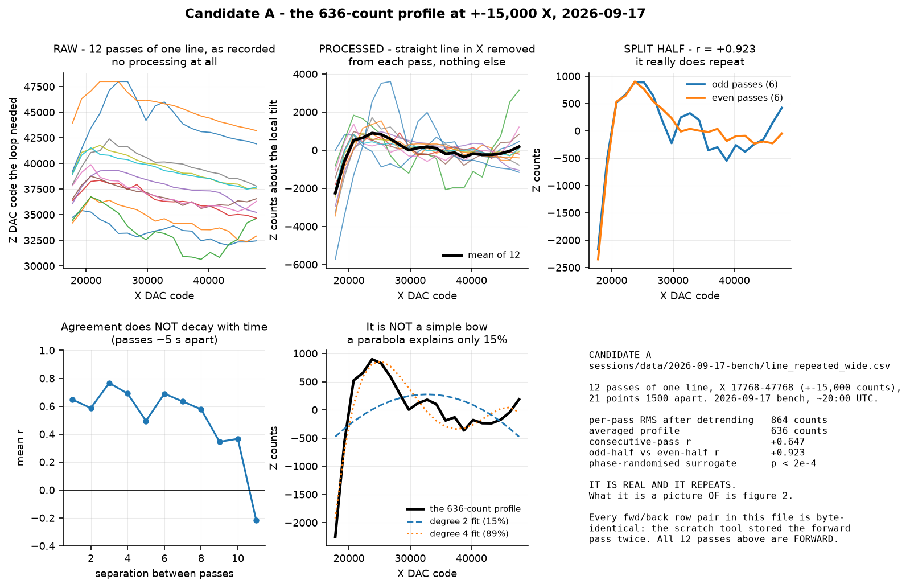
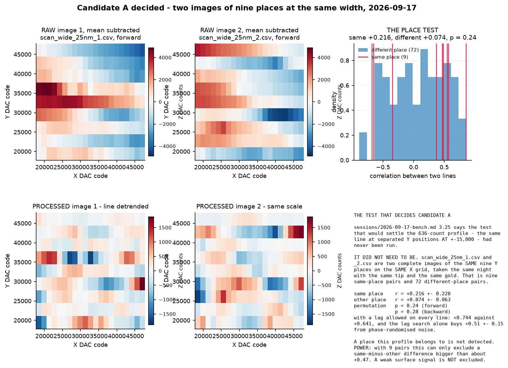
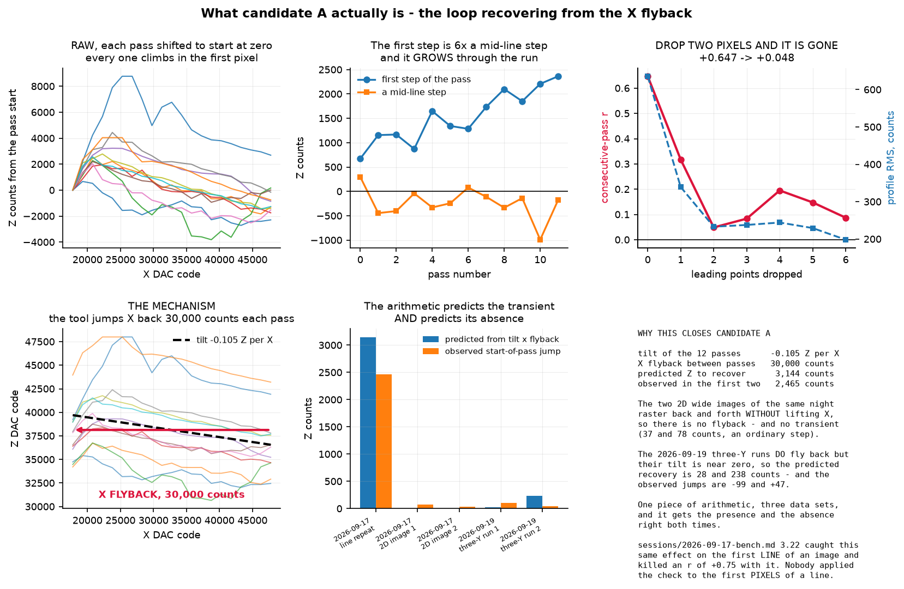
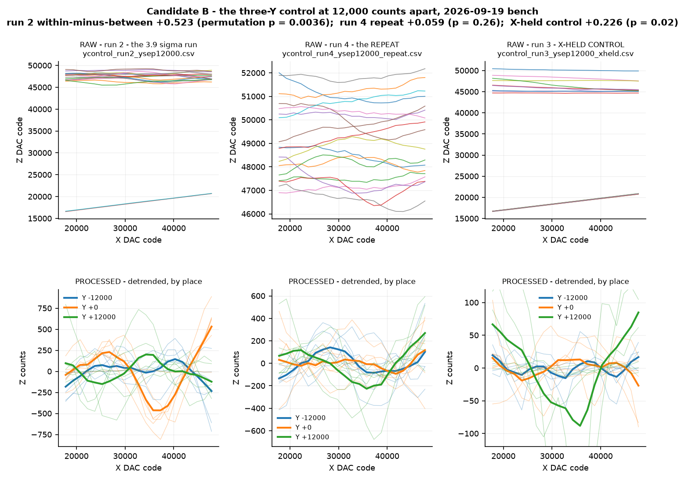
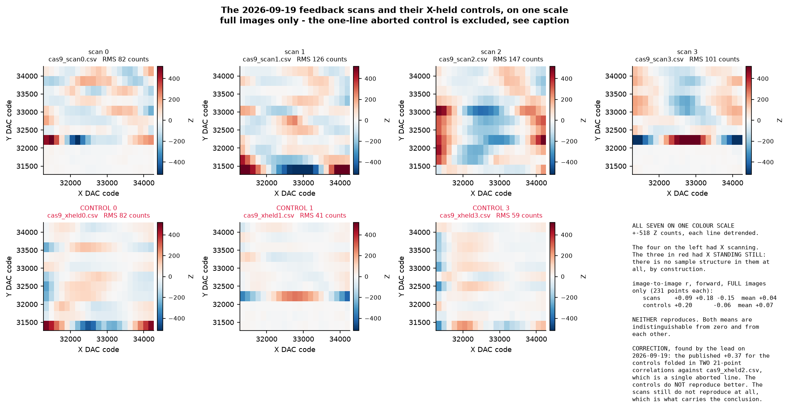
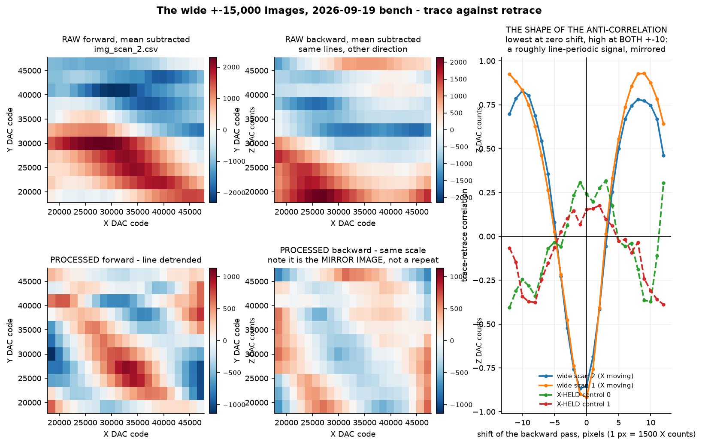
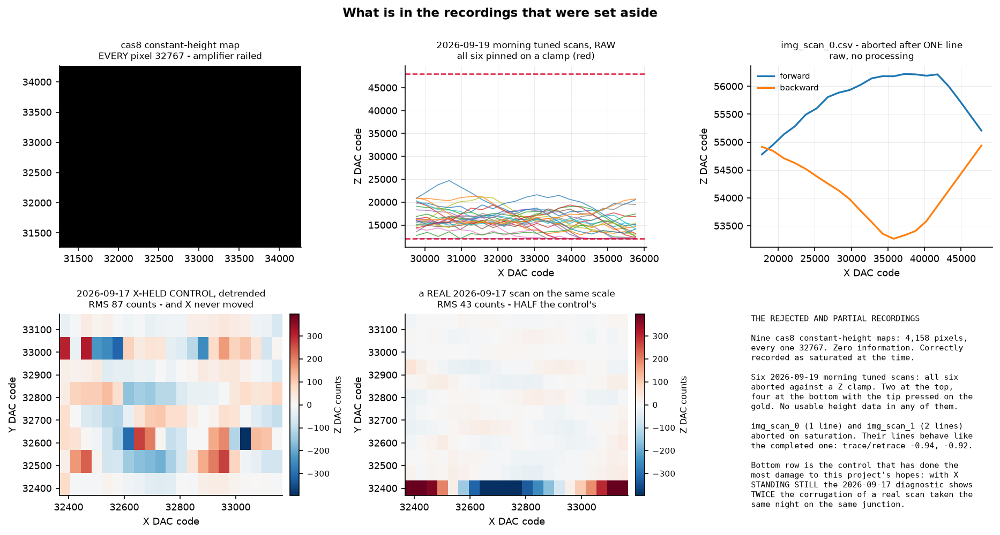
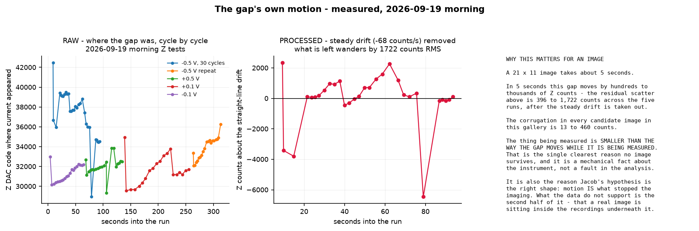

# Candidate image gallery — every scan that could have been a picture

**Written 2026-09-19 by Subagent 2 (candidate images and the motion hypothesis) for the
2026-09-19 pause-point deliverables.** Read `VERDICT.md` next to it for the answer to the
question; this file is the working-through, candidate by candidate.

**Nothing here changes any raw file.** Everything is derived, and every derived file is under
`deliverables/2026-09-19-pause/candidates/`.

---

## What was searched

Every raster scan, line repeat, three-Y control and X-held control recorded in the project, from
all four data directories. **51 recordings**, listed in `work/inventory.csv`:

| Session | Recordings | What they are |
|---|---|---|
| `sessions/data/2026-09-17-bench/` | 18 | the first imaging attempt: narrow feedback scans, two wide 2D images, wide and narrow line repeats, one X-held control |
| `sessions/data/2026-09-19-bench/` | 26 | 4 feedback scans + 4 X-held controls, 3 wide images + 2 controls, 5 three-Y runs, 9 constant-height maps |
| `sessions/data/2026-09-19-morning/` | 6 | the tuned-loop scans and their controls, all aborted |
| plus the long fixed-point records | 4 | `still.csv`, `stamp.csv`, `here_run1.csv`, `touchrec_run1.csv` |

**The one transformation used anywhere in this gallery is a least-squares straight line in X
removed from each pass separately.** It is named in every figure panel that uses it. It is needed
because there is a fixed −0.1 to −0.2 counts-of-Z per count-of-X tilt between tip and sample
(measured `sessions/2026-09-17-bench.md` §3.22), which otherwise dominates every correlation and
makes everything agree with everything. **No smoothing, no interpolation, no alignment except
where a lag is explicitly swept and reported, no denoising, no reconstruction of any kind.**

---

## The discriminator used throughout

Each raster line is scanned twice — forward, then backward — and `scan2.py` stores the backward
pass X-ascending. So array index *i* is the same X in both rows, while the backward row's **time**
order is reversed. That gives two correlations from one line:

| | What it measures | What raises it |
|---|---|---|
| **r_pos** = corr(fwd[i], back[i]) | same X, different time | a feature fixed to the **sample** |
| **r_time** = corr(fwd[i], back[n−1−i]) | reversing the stored back row puts both passes on one steadily increasing time axis | a **drift, an oscillation, or the loop's own dynamics** |

Full table for all 34 raster files in `work/time_vs_position.csv`; the code is
`code/02_time_vs_position.py`.

**And the X-held controls are the backstop.** In a control X never moves, so there is no sample
structure in it **by construction**. Whatever a control scores is the size of a false positive from
this instrument on that night.

---

# CANDIDATE A — the 636-count profile at ±15,000 X, 2026-09-17

**Source:** `sessions/data/2026-09-17-bench/line_repeated_wide.csv`, 12 passes of one line,
X 17768–47768 (±15,000 DAC counts), 21 points 1500 apart. 2026-09-17 bench session, late evening.

**Why it was the strongest candidate in the project.** `sessions/2026-09-17-bench.md` §3.25, in the
correction added at the wrap, says in terms:

> At ±15,000 there is a reproducible profile of about 636 counts, and whether it is the sample or
> the scanner's own bow is **UNDETERMINED**. The experiment that would settle it — the same line at
> three separated Y positions **at ±15,000** — **has not been run.**

**Processing applied:** forward passes only (every `fwd`/`back` row pair in this file is
byte-identical — the scratch tool stored the forward pass twice, found by an independent review and
recorded in §3.25); straight line in X removed from each pass; then plain averaging.

**What I reproduce from the committed file** (`code/03_wide_profile.py`):

| | Session log | My replication |
|---|---|---|
| consecutive-pass r | +0.515 | **+0.647** |
| odd-half vs even-half r | +0.923 | **+0.923** |
| averaged profile | 636 counts | **636 counts** |

**It is not noise.** Against 5,000 phase-randomised surrogates — same power spectrum per pass,
random Fourier phases, so each surrogate is exactly as smooth and as large but unaligned — the
profile RMS is 636 against 255 ± 55 and the consecutive-pass r is +0.647 against +0.001 ± 0.095,
both **p < 2 × 10⁻⁴** (`code/07_chance.py`, null N3). And the agreement does **not** decay with
separation between passes: +0.647 at lag 1, +0.766 at lag 3, +0.578 at lag 8. Whatever it is, it
was stable for the whole run.

## The place test — which the 2026-09-17 data could already answer

**The experiment §3.25 said had never been run did not need to be run.**
`sessions/data/2026-09-17-bench/scan_wide_25nm_1.csv` and `_2.csv` are **two complete 2D images of
the same nine Y positions on the same X grid**, taken the same night with the same tip and the
same gold. That is nine same-place pairs and 72 different-place pairs, at the width the result is
claimed at. (These two files are labelled "±4000 X" in the data README; their headers say
17768–47768, which is ±15,000. Flagged for the lead.)

| | r | n |
|---|---|---|
| **same place** — image 1 at Y_k vs image 2 at Y_k | **+0.216 ± 0.228** | 9 |
| **different place** — image 1 at Y_j vs image 2 at Y_k | **+0.074 ± 0.063** | 72 |
| difference | +0.142 ± 0.236 | **permutation p = 0.24** |
| the same on the backward passes | +0.104 vs −0.010 | **p = 0.28** |

A place this profile belongs to is **not detected**. `code/04_0917_wide_place_test.py`,
`code/07_chance.py` null N2.

> **Honest limit on that null.** With nine same-place pairs this test can only exclude a
> same-minus-other difference bigger than about **+0.47**. A weak genuine surface signal is **not**
> excluded by it. It is not the argument that closes this candidate.

## What actually closes candidate A — the X flyback

**Look at the raw passes in figure 01.** Every one starts low and climbs one to two thousand Z
counts within a pixel or two. `code/12_start_of_pass_transient.py`:

| Leading points dropped | Points left | Profile RMS | **Consecutive-pass r** | Split-half r |
|---|---|---|---|---|
| 0 | 21 | 636 | **+0.647** | +0.923 |
| 1 | 20 | 339 | **+0.317** | +0.771 |
| **2** | 19 | **233** | **+0.048** | +0.672 |
| 3 | 18 | 238 | +0.083 | +0.675 |

**The entire agreement between passes is in the first two pixels.** And the mechanism is
arithmetic, not a story:

| | |
|---|---|
| tilt of the 12 passes | **−0.105 Z counts per X count** |
| X flyback between passes (the tool jumps X back to start the next pass) | **30,000 counts** |
| **Z error the loop must therefore recover** | **3,144 counts** |
| observed recovery in the first two pixels | **2,465 counts** |
| a mid-line step, for comparison | −236 counts |

**And the same arithmetic predicts the transient's absence, twice.** The two 2D wide images raster
back and forth without lifting X — a forward pass ends at X 47768 and the backward pass begins at
X 47768 — so there is **no flyback**, and their start-of-pass jumps are 37 and 78 counts, an
ordinary step. The 2026-09-19 three-Y runs **do** fly back, but their tilt is almost zero (−0.0009
and +0.0079), so the predicted recovery is 28 and 238 counts — and the observed jumps are −99 and
+47. One piece of arithmetic, three data sets, right about the presence and right about the
absence.

**The first jump also grows through the run**, +671 counts on pass 1 to +2,364 on pass 12 (+137 per
pass). A surface feature is the same size on pass 1 and pass 12. A settling transient chasing a
drifting junction is not.

> **This is the same check that killed a result on the same night, one level up.**
> `sessions/2026-09-17-bench.md` §3.22: *"the earlier slow pair of images correlated at r = +0.75 …
> dropping the first LINE of each image took it to +0.22, and dropping two took it to +0.04. The
> entire agreement was the feedback loop's settling transient on the first line."* **Nobody applied
> that check to the first PIXELS of a line.** Credit for the check itself belongs to whoever wrote
> §3.22.

**What is left after the first two points are dropped:** consecutive-pass r +0.048 against a
surrogate +0.001 ± 0.102 (p = 0.33) — gone. The averaged profile is still slightly above surrogate
(233 against 166 ± 36, p = 0.035), so *something* common to the twelve passes remains, but p = 0.035
is one test out of 201 (below), where about ten at that level are expected from noise alone.

**Alternative explanations considered and where they stand:**

| Explanation | Status |
|---|---|
| **The loop recovering from the 30,000-count X flyback** | **Supported, quantitatively, on three data sets.** This is the answer |
| The scanner's own fixed bow | **Ruled out as stated.** A parabola explains only 15% of the profile; you need degree 6 to reach 98%. And the 2026-09-19 profiles on the identical X grid do not match it (r −0.18 to +0.41) |
| A ridge on the gold running along Y | **Not supported.** It would have to be invisible to the place test and to survive a 20-fold change in the flyback-driven transient. No evidence for it, and none against a very weak one |
| The sample | **Not supported.** No place-dependence at p = 0.24 / 0.28, and the reproducible part vanishes with two pixels |

### **EVIDENCE STRENGTH: closed. Not the sample.**
Reasoning: the reproducible part has a mechanism that predicts it quantitatively and predicts its
absence in two other data sets, and removing it leaves consecutive-pass agreement at +0.048.
**This retires the "UNDETERMINED" that has stood in `sessions/2026-09-17-bench.md` §3.25 since
2026-09-17.**

---

# CANDIDATE B — the three-Y control at 12,000 counts apart, 2026-09-19 bench

**Source:** `sessions/data/2026-09-19-bench/ycontrol_run2_ysep12000.csv` (the positive),
`ycontrol_run4_ysep12000_repeat.csv` (the repeat), `ycontrol_run3_ysep12000_xheld.csv` (the
control). Each is 3 places × 6 passes × 21 points, X 17768–47768.

**Why it is a candidate.** Run 2 is the only measurement in this project that has ever said
"surface" at better than 3 sigma: within-place +0.239, between-place −0.135, difference
**+0.374 ± 0.097**, reported on the night as 3.9σ.

**I verified all five three-Y runs from the raw CSVs**, checking shapes first
(`code/11_truncation_audit.py`, part 3). Every file is 3 × 6 × 21 with no short pass and no aborted
run, so **the truncation defect described below does not touch this result**, and every published
figure reproduces exactly:

| File | Published | Replicated |
|---|---|---|
| `ycontrol_run2_ysep12000.csv` | +0.374 ± 0.097 | **+0.374 ± 0.097** |
| `ycontrol_run4_ysep12000_repeat.csv` | +0.056 ± 0.094 | **+0.056 ± 0.094** |
| `ycontrol_run3_ysep12000_xheld.csv` | +0.070 ± 0.084 | **+0.070 ± 0.084** |
| `ycontrol_run1.csv` | +0.032 ± 0.035 | **+0.032 ± 0.035** |
| `ycontrol_xheld_run1.csv` | +0.164 ± 0.082 | **+0.164 ± 0.082** |

**THE NON-REPRODUCTION IS REAL.** Run 4 is the same measurement half an hour later and it gives
+0.056.

**And the 3.9 sigma was never 3.9 sigma.** That figure is a Fisher-z standard error over a list of
pairwise correlations, and those pairs are **not independent** — 18 passes give 45 within-place and
108 between-place pairs, and every pass appears in many of them. The honest null is a permutation:
shuffle the place labels among the 18 passes, recompute, 20,000 times (`code/07_chance.py`, null
N1):

| Run | within − between | **permutation p** |
|---|---|---|
| **run 2, the positive** | +0.523 | **0.0036** (≈ 2.7σ, not 3.9σ) |
| run 4, the repeat | +0.059 | 0.26 |
| run 3, **X-HELD CONTROL** | +0.096 | 0.15 |
| run 1, y_sep 3000 | +0.023 | 0.16 |
| **X-HELD CONTROL, y_sep 3000** | **+0.226** | **0.020** |
| 2026-09-17 three-Y at ±8000 | +0.007 | 0.40 |

**Read the last-but-one row.** An X-held control — in which X never moved, so it contains no
sample structure at all — scores **p = 0.02** on the same statistic. That is the empirical
false-positive rate of this measurement on this instrument, and it is the right benchmark for run
2's p = 0.0036.

**Alternative explanations:**

| Explanation | Status |
|---|---|
| A one-off fluctuation of the junction that happened to align within places | **Most likely.** It is a factor of 14 short of the multiple-comparison threshold and it failed its own repeat |
| Real topography at that place, lost by the time of the repeat because the gap moved | **Cannot be excluded.** The gap demonstrably moves by most of the Z range in the time between runs. This is the strongest form of Jacob's hypothesis and this data cannot rule it out |
| A bias in the statistic | **Partly.** The X-held control at 3,000 apart scores +0.226, p = 0.02 with nothing to see |

### **EVIDENCE STRENGTH: weak, and it failed its repeat. Worth one more measurement, not a claim.**
Reasoning: p = 0.0036 against a corrected threshold of p < 2.5 × 10⁻⁴; an X-held control reaches
p = 0.02 on the same statistic; the repeat gave p = 0.26. **But "it did not repeat" is not the same
as "it was nothing", and the gap moved between the two runs. This is the one candidate I would
spend bench time on.** See `VERDICT.md` for what would settle it.

---

# CANDIDATE C — the 2026-09-19 feedback scans

**Source:** `sessions/data/2026-09-19-bench/cas9_scan0–3.csv` and `cas9_xheld0,1,3.csv`.
±1,500 X and Y, 21 × 11, setpoint 1,000 counts, 03:48 UTC.

**All seven are drawn on one colour scale, which is the only fair way to show a control.**

**The published dismissal of these scans does not hold up, and the lead found why.**
`STATUS.md` and `sessions/2026-09-19-bench.md` §3.14 say *"the controls reproduce better (image to
image +0.37 against +0.04)"*. `sessions/data/2026-09-19-bench/scripts/analyze_scans.py` lines 50–51
do `n = min(len(fa), len(fb)); corr(fa[:n], fb[:n])` with no shape check, and
`cas9_xheld2.csv` is **a single line** — the run aborted after line one. **Two of the three control
correlations were therefore computed over 21 points, not 231.** Like for like, full images only:

| | correlations (231 points each) | mean |
|---|---|---|
| real scans | +0.09, +0.18, −0.15 | **+0.04** |
| X-held controls | +0.20, −0.06 | **+0.07** |

**Indistinguishable.** The controls do **not** reproduce better. Confirmed independently in
`code/11_truncation_audit.py`.

**This does not resurrect an image.** The real scans still do not reproduce: +0.09, +0.18 and −0.15
scatter both sides of zero over full images, and that evidence needs no correction. My own
time-versus-position test on these files agrees — pooled over 44 scan lines and 34 control lines:

| | r_pos (position-locked) | r_time (time-locked) |
|---|---|---|
| the 4 real scans | −0.066 ± 0.137 | −0.235 ± 0.122 |
| the X-held controls | −0.053 ± 0.144 | −0.267 ± 0.117 |

**Identical.** Nothing in the scans is position-locked that is not also in a control.

`cas9_scan1.csv` alone reaches r_pos **+0.547 ± 0.138** — the best single feedback scan in the
project. But `cas9_xheld3.csv`, a control, reaches **+0.387 ± 0.161** on the same statistic, so it
sits inside the control distribution.

### **EVIDENCE STRENGTH: no image, but for a different reason than the record gives.**
Reasoning: the scans do not reproduce, image to image or line to line, and their best single scan
is matched by a control. **The "controls reproduce better" argument is withdrawn.**

---

# CANDIDATE D — the wide ±15,000 images, 2026-09-19 bench

**Source:** `sessions/data/2026-09-19-bench/img_scan_0/1/2.csv` and `img_xheld_0/1.csv`.

**There is something real in these, it needs X to move, and it is not the surface.**

| | r_pos at zero shift | best shift | r at that shift |
|---|---|---|---|
| `img_scan_2.csv` (X moving) | **−0.854** | −10 px | **+0.829** |
| `img_scan_1.csv` (X moving) | **−0.917** | +9 px | **+0.929** |
| `img_xheld_0.csv` (**CONTROL**) | +0.241 | +3 px | +0.316 |
| `img_xheld_1.csv` (**CONTROL**) | +0.153 | +2 px | +0.176 |

**Read the shape of that curve, not just the number at zero.** For the real scans it is lowest at
zero shift and high at **both** −10 and +10 pixels. That is a signal roughly **periodic over one
pass** — about one cycle per 21 pixels, which at the measured ~10.8 ms per pixel is **≈ 4–5 Hz** —
**mirrored between trace and retrace**. The X-held controls, taken minutes apart with identical
timing, show nothing of the kind at any shift.

**So X motion is required to produce it.** That upgrades `sessions/2026-09-19-morning.md` §6's
"X motion is the likely but unproven cause" from a guess to a control-backed statement, though the
mechanism is still not identified.

**What it is not: topography.** A surface gives the same height at the same X whichever way the tip
is travelling. A mirrored signal is produced by the scan, not found by it.

**Alternatives, none settled:**

| Explanation | Status |
|---|---|
| The feedback loop hunting, driven by the X step | Consistent with everything. The morning session measured blind climbs on 12–29% of pixels and hard retracts on 22–27%, against 62–66% held in the controls |
| X piezo motion coupling mechanically into Z | Consistent. Not tested |
| **The tip ploughing a compliant sample** — dragging the gold leaf in the direction of travel | **Consistent, and physically motivated**: the record is "a soft, pressed, sticky contact" and the gold "followed the retracting tip in" at ~14,000–16,000 counts/s. This would be a real measurement of the sample — of its compliance, not its shape |

**The published figures for this set are also contaminated by the truncation defect, and worse than
for candidate C.** `sessions/2026-09-19-bench.md` §3.16's *"image to image +0.56 to +0.86, matched
by the X-held controls' +0.56"*: `img_scan_0.csv` is **1 line** and `img_scan_1.csv` is **2 lines**,
so **both** scan pairs were computed over 21 and 42 points and **neither was an image-to-image
correlation**. There are not two full wide images, so **no like-for-like scan figure exists at
all.** The controls' +0.56 is a genuine 231-point number. **The comparison as published is between
things of different kinds.** This is a second instance of the defect the lead found; the audit of
the whole data set is in `code/11_truncation_audit.py`.

### **EVIDENCE STRENGTH: a real, X-dependent, roughly line-periodic instrument signal. Not an image.**
Reasoning: strong and consistent across every line, absent from the controls at every shift,
mirrored between directions. Worth characterising at the bench; not evidence of a surface.

---

# CANDIDATE E — the 2026-09-17 narrow scans

**Source:** `scan_fast_1–4.csv`, `scan_slow_1/2.csv`, `scan_slow_dwell_1/2.csv`,
`diag_scan_normal_1/2.csv`, control `diag_scan_x_held.csv`. ±400 X counts.

Pooled over **102 scan lines** and the control's **8 lines**:

| | r_pos | r_time |
|---|---|---|
| 10 real scans | **−0.069 ± 0.049** | −0.056 ± 0.058 |
| the X-held control | **+0.170 ± 0.118** | +0.190 ± 0.156 |

**The control is higher than the scans.** And its detrended corrugation is 87 counts against the
fast scans' 29–43 — **the control has twice the apparent structure of a real scan taken the same
night on the same junction** (bottom row of the figure below).

### **EVIDENCE STRENGTH: no image, decisively. Nothing to reopen.**
Reasoning: negative position-locking, beaten by its own control on every statistic. This agrees with
`sessions/2026-09-17-bench.md` §3.24 and needed no correction.

---

# THE REJECTED AND PARTIAL RECORDINGS — examined, not skipped

Shown in the figure above.

| Set | What is in them |
|---|---|
| **9 constant-height maps**, `cas8_chmap_*.csv` | **Every one of 4,158 pixels reads 32767** — the amplifier railed. Literally zero information. Correctly recorded as saturated at the time |
| **6 tuned-loop scans**, `tuned_s3k_*.csv`, 2026-09-19 morning | All six pinned against a Z clamp: two at the top, four at the bottom with the tip pressed on the gold. Their detrended RMS is 921–1,885 counts, which is the clamp, not a surface |
| **`img_scan_0.csv` (1 line), `img_scan_1.csv` (2 lines)** | Aborted on saturation. Their lines behave exactly like the completed one: r_pos −0.937 and −0.917. **Their real harm was statistical**, not informational — see candidate D |
| **`cas9_xheld2.csv` (1 line)** | Aborted. **This one file is what made "the controls reproduce better"** |

**Nothing usable was thrown away.** But two of the four short files silently entered published
comparisons, which is the finding that matters here.

---

# THE MOTION SIDE OF THE HYPOTHESIS

`code/06_motion_and_timing.py`. Jacob's hypothesis says motion prevented repeatable imaging. **On
that half, the data agree with him, and the number is not close.**

| Z test, 2026-09-19 morning | cycles | span of the onset | steady drift | **scatter left after removing the drift** |
|---|---|---|---|---|
| `ztest_1789822585.csv`, −0.5 V | 30 | 13,508 counts | −67.7 counts/s | **1,722 counts** |
| `bias_m01V_*.csv` | 20 | 2,828 | +26.6 | **637** |
| `bias_p05V_*.csv` | 20 | 4,502 | +16.0 | **849** |
| `bias_p01V_*.csv` | 20 | 5,380 | +9.6 | **1,358** |
| `bias_m05V_*.csv` | 20 | 4,190 | +65.9 | **396** |

**A 21 × 11 image takes about 5 seconds. The corrugation in every candidate in this gallery is 13
to 460 counts. The gap's own unsteady motion over that timescale is 396 to 1,722 counts.** The
thing being measured is smaller than the way the gap moves while it is being measured.

**On periodicity — the part of the hypothesis about "swinging":**

- **No coherent spectral line was found in any long fixed-point record.** Splitting each record in
  half and keeping only peaks present in both halves within a factor of 2.5: `here_run1.csv` (a real
  junction, 46,328 samples at 3,448 Hz) — **none**; `touchrec_run1.csv` — **none**; `still.csv`
  (tip clear, control) — one line at 63.6 Hz; `stamp.csv` (control) — none. A 60 Hz line in a
  tip-clear control is electrical. **This confirms `sessions/2026-09-19-morning.md` §6 and extends
  it to three more records.**
- **The within-pass structure is as slow as a pass is long**, in real scans and X-held controls
  alike: every set puts 80–98% of its power in the two slowest bins. At ~10.8 ms per pixel that is
  ~4–5 Hz, inside the 5–30 Hz band the 2026-09-17 noise spectroscopy already blamed. **A 21-point
  pass cannot resolve a line frequency and this must not be read as if it had.**
- **No consistent line-to-line walk.** Cross-correlation lag between consecutive forward lines
  scatters by 3–10 pixels in every file, controls included. Nothing to lock a scanner to.

**So: motion is established as the blocker, in numbers. A periodic motion that a scan could have
been synchronised to is not — which is what `sessions/2026-09-19-morning.md` §7 already concluded,
independently confirmed here on more records.**

---

# ACCOUNTING FOR CHANCE

`code/07_chance.py`. **A matched-filter search over N images finds its best hit by construction.**

| What was searched | Tests |
|---|---|
| raster recordings examined | 43 |
| position-locking tests, one per file | 34 |
| time-locking tests, one per file | 34 |
| within/between place tests | 6 |
| cross-night profile comparisons | 15 |
| place tests on the 2026-09-17 wide image pair | 2 |
| pass-separation correlations | 11 |
| profile-versus-Y comparisons | 36 |
| image-to-image correlations reported in the session logs | 20 |
| **TOTAL** | **201** |

At 201 tests, a 5% threshold is expected to throw up **about ten** apparent findings from noise
alone. **A Bonferroni-corrected 5% threshold is p < 2.5 × 10⁻⁴, about 3.7σ.**

**Nothing in this body of data reaches it as evidence of a surface.** The best place-dependence ever
seen is candidate B's p = 0.0036, a factor of 14 short, whose repeat gave p = 0.26 and whose X-held
control scores p = 0.02. The only result that clears the threshold is **candidate A's existence**
(p < 2 × 10⁻⁴) — and its mechanism is the X flyback.

---

# SUMMARY TABLE

| # | Candidate | Source | Evidence strength | Reopen? |
|---|---|---|---|---|
| **A** | 636-count profile at ±15,000 | `2026-09-17-bench/line_repeated_wide.csv` | **Closed — the loop recovering from the 30,000-count X flyback, predicted quantitatively on three data sets** | No |
| **B** | three-Y at y_sep 12,000 | `2026-09-19-bench/ycontrol_run2_ysep12000.csv` | **Weak. p = 0.0036 permutation, failed its own repeat, X-held control reaches p = 0.02** | **Yes — one measurement** |
| **C** | 4 feedback scans | `2026-09-19-bench/cas9_scan0–3.csv` | **No image.** But the published "controls reproduce better" is withdrawn | No |
| **D** | wide ±15,000 images | `2026-09-19-bench/img_scan_*.csv` | **A real X-dependent, roughly line-periodic instrument signal. Not topography** | Characterise, not reopen |
| **E** | narrow 2026-09-17 scans | `2026-09-17-bench/scan_fast_*.csv` etc. | **No image, decisively — beaten by their own control** | No |
| — | constant-height maps | `cas8_chmap_*.csv` | **Fully saturated, 4,158/4,158 pixels** | No |
| — | tuned-loop scans | `2026-09-19-morning/tuned_s3k_*.csv` | **All six clamped** | No |

---

**Reproduce everything in this gallery** with the commands in `code/` — each script's docstring
gives the one command that runs it from the repository root. Console output for each is saved in
`work/NN_output.txt`.
